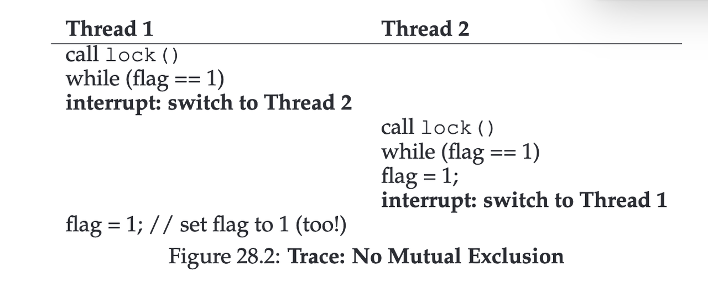

---
tags:
  - OSTEP
  - Locks
  - Concurrency
---

# 28. Locks

在系统层面，锁是一种用于协调并发访问的共享资源；在语言/实现层面，锁通常表现为一个或一组共享变量。

评价锁的三个方面：

1. mutual exclusion：保证互斥
   
2. fairness：保证不存在无限期等待的线程，即不会发生饥饿（starvation）；理想情况下，等待时间是有界的。
   
3. performance：无竞争、轻度竞争、重度竞争时，锁的效率如何

## 如何实现锁？

这一章讲的是锁在真实情况下锁是如何实现的：需要一些硬件上更强大的指令，和一些操作系统所支持的原语。

首先，mutual exclusion 是怎么保证的？靠的就是「关中断」和「原子硬件指令」。

**尝试 1: OS 层面的关闭中断 Turning off Interrupts**

一种最早期的互斥实现思路是在操作系统内核中临时关闭中断（就是是四种异常之一的那个中断）。

通过在进入临界区前关闭中断，在退出临界区后重新开启中断，可以保证当前执行流在临界区内不被抢占，从而在表面上实现原子性。

turn off interrupts 是谁做的？谁有权限让 cpu 都不 interrupt？

关闭中断用的 DisableInterrupts() / EnableInterrupts() 不是普通函数，它们是内核函数，最终会执行 CPU 的特权指令，用户态程序无法直接关闭中断，只有操作系统内核可以调用。

这个做法的缺点很多：

1. 恶意程序 DisableInterrupts 后不 Enable，独占 cpu
   
2. 多核 cpu 的问题。中断是每个 CPU 核私有的。线程的栈只保护“局部变量”，只要不是栈上的东西，默认都是共享的。核 a 关闭中断了，其他核 b 上的线程还是可以 access 共享数据。
   
3. 最主要的问题，中断的丢失可导致操作系统严重的错误。比如关闭中断期间，如果设备发出中断请求，中断信号可能被忽略而非排队。

由于上述问题，通过关闭中断实现锁仅在极其有限的内核场景中使用。

**尝试 2: 软件层面的锁**

关闭中断的方法无法在多处理器上工作，所以系统设计者开始希望造出「锁」。

一种尝试是：（反例）

```c
typedef struct __lock_t {
    int flag;   // 0 -> lock is free, 1 -> lock is held
} lock_t;

void init(lock_t *mutex) {
    mutex->flag = 0;
}

void lock(lock_t *mutex) {
    while (mutex->flag == 1) // #10
        ;               // #11 busy waiting (spin)
    mutex->flag = 1;    // #12 acquire the lock
}

void unlock(lock_t *mutex) {
    mutex->flag = 0;
}
```

乍一看是对的，但问题是，这个锁不是原子的。在 lock 内部，第 10 行 while 语句读内存（load），12 行写内存（store），这两个操作不是原子的。

假设初始状态：mutex->flag = 0，有可能发生：



两个线程都 set flag=1, 拿到锁并进入临界区，没有实现正确的互斥。（更不用说 spin 的性能问题了）

(我对这个错误实现的理解是：想要用锁来保护临界区，但是锁自己却变成了临界区。)

锁的互斥，靠普通的“先读再写”的软件是无法实现的，只能依赖于**硬件提供的原子操作原语（atomic primitives）**，这是并发控制的基础。


## 硬件原语（atomic primitives）解决方案

### Test-And-Set

Test-and-Set 是一种由硬件提供的原子「读-改-写」操作原语。

它将对锁变量的“读取旧值（test）”和“写入新值（set）”合并为一个不可分割的原子操作，从而保证在并发执行环境中，至多只有一个线程能够成功将锁从未占用状态转换为占用状态。

在多核系统中，CPU 在执行 Test-and-Set 时，会通过缓存一致性协议（或早期系统中的总线锁定机制）独占目标内存地址所在的缓存行的修改权限，从硬件层面防止其他处理器同时观察或修改该内存位置，进而保证操作的原子性与全局可见性。

在 x86, Test-and-Set 的实现是靠 xchg 指令。

```c
void lock(lock_t *l) {
    while (TestAndSet(&l->flag) == 1)
        ; // spin
}
```


### Compare-And-Swap

Compare-And-Swap 也是是一种由硬件提供的原子「读-改-写」操作原语。

把“1. 从内存地址中读取旧值（old） 2. 将该旧值与期望值（expected）进行比较 3. 若相等，则将内存中的值更新为新值（new）”合并为一个不可分割的原子操作。

```c
void lock(lock_t *l) {
    while (!CompareAndSwap(&l->flag, 0, 1)) //只有当锁当前是 0 时，才把它设为 1
        ; // spin
}
```

在 x86, CAS 的实现是靠 cmpxchg 指令。（单独有一个硬件指令）
CAS 比 TAS 强大一些，更适合复杂并发结构。


### Load-Linked and Store-Conditional

### Fetch-And-Add

```c
typedef struct __lock_t {
    int ticket; // 下一个可发放的票号
    int turn; // 当前正在服务的票号，谁的票号 == turn，谁就能进临界区
} lock_t;

void lock_init(lock_t *lock) {
    lock->ticket = 0;
    lock->turn = 0;
}

void lock(lock_t *lock) {
    int myturn = FetchAndAdd(&lock->ticket);
    while (lock->turn != myturn)
        ; // spin
}

void unlock(lock_t *lock) {
    lock->turn = lock->turn + 1;
}
```

Ticket lock 使用原子 FetchAndAdd 分配唯一票号，线程按票号顺序自旋等待 turn，解锁时递增 turn，从而实现公平的自旋锁。

### yield