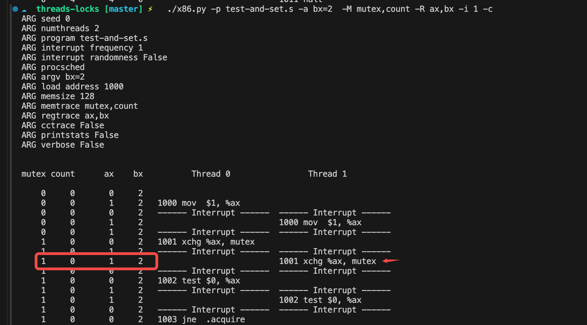
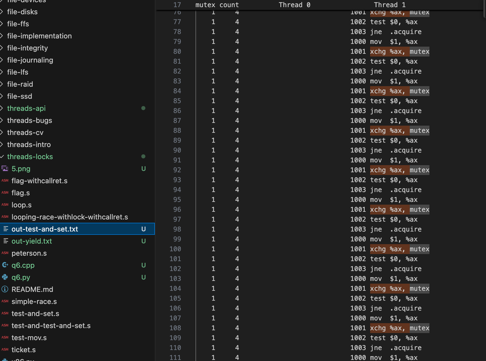

# 28. Homework

[README](https://github.com/remzi-arpacidusseau/ostep-homework/blob/master/threads-locks/README.md)

## Question 1

```
.var flag
.var count

.main
.top

.acquire
mov  flag, %ax      # get flag
test $0, %ax        # if we get 0 back: lock is free!
jne  .acquire       # if not, try again
mov  $1, flag       # store 1 into flag

# critical section
mov  count, %ax     # get the value at the address
add  $1, %ax        # increment it
mov  %ax, count     # store it back

# release lock
mov  $0, flag       # clear the flag now

# see if we're still looping
sub  $1, %bx
test $0, %bx
jgt .top	

halt
```

`bx` 起到控制循环次数的作用。`bx` 的初值是程序开始前在运行环境里设定的。

虽然这个代码试着用锁来保护 `count++` 的操作（先获取锁，再 `count++`，再释放锁），但是“检查锁、获取锁”这个操作不是原子的。有可能线程 A 在 `mov  flag, %ax` 步骤得到 `flag = 0`；线程 B 也在这个步骤得到 `flag = 0`；两个线程都写 `flag = 1`，同时进入临界区。

至于为什么不能直接 `test flag, $0`，而要把 flag 拿到寄存器 ax 里比较？在 x86 指令设计里，大多数算术/测试指令不能直接做 memory–memory 操作，OSTEP 作业的 x86 模型也遵循 load–operate–store 模型。但更重要的是，无论是否直接比较内存，其实只要不是原子 read–modify–write，在并发下这个锁都是错的。

## Question 2

使用 `x86.py` 模拟器运行这个程序：`./x86.py -p flag.s -M flag,count -R ax,bx -c`

`-M flag,count` 用于查看共享变量 `flag` `count` 的值，`-R ax bx` 用于查看每个线程私有寄存器的值。

使用默认值运行时，控制转移发生在一个线程全部执行完之后。count 幸运地正确被加了 2.

```
flag count      ax    bx          Thread 0                Thread 1         

    0     0       0     0   
    0     0       0     0   1000 mov  flag, %ax
    0     0       0     0   1001 test $0, %ax
    0     0       0     0   1002 jne  .acquire
    1     0       0     0   1003 mov  $1, flag
    1     0       0     0   1004 mov  count, %ax
    1     0       1     0   1005 add  $1, %ax
    1     1       1     0   1006 mov  %ax, count
    0     1       1     0   1007 mov  $0, flag
    0     1       1    -1   1008 sub  $1, %bx
    0     1       1    -1   1009 test $0, %bx
    0     1       1    -1   1010 jgt .top
    0     1       1    -1   1011 halt
    0     1       0     0   ----- Halt;Switch -----  ----- Halt;Switch -----  
    0     1       0     0                            1000 mov  flag, %ax
    0     1       0     0                            1001 test $0, %ax
    0     1       0     0                            1002 jne  .acquire
    1     1       0     0                            1003 mov  $1, flag
    1     1       1     0                            1004 mov  count, %ax
    1     1       2     0                            1005 add  $1, %ax
    1     2       2     0                            1006 mov  %ax, count
    0     2       2     0                            1007 mov  $0, flag
    0     2       2    -1                            1008 sub  $1, %bx
    0     2       2    -1                            1009 test $0, %bx
    0     2       2    -1                            1010 jgt .top
    0     2       2    -1                            1011 halt
```
注意，一行里左边的寄存器的值是在同一行右边计算之后得到的。

## Question 3

设置 bx 初始值为 2. `./x86.py -p flag.s -a bx=2  -M flag,count -R ax,bx -c`

控制转移依然发生在一个线程全部执行完之后。每个线程顺利把 count 增加 2 次，一共增加 4 次。最终 flag 还是 0. 

## Question 4

将 bx 设置为一个较大值，让一个线程多循环几次。然后使用 `-i` 标志控制不同的中断频率。
只要中断发生频率比较高，发生在一个线程执行的内部，就有可能两个线程同时获取了锁，同时进入临界区。

举一个同时进入临界区的例子：`./x86.py -p flag.s -a bx=2  -M flag,count -R ax,bx -i 2 -c`


两次执行 add, count 只加了一次。

## Question 5

x86 里的 atomic exchange 指令叫做 xchg.

现在，获取锁是这样完成的：

```
mov  $1, %ax        
xchg %ax, mutex     # atomic swap of 1 and mutex
```

`xchg %ax, mutex` 保证了：“1. 读 mutex 2. 写 mutex 3. 交换结果” 是一个原子操作。

释放锁是：

```
mov  $0, mutex
```

## Question 6

`./x86.py -p test-and-set.s -a bx=2  -M mutex,count -R ax,bx -i 1 -c`

无论把 i 的频率设置为多少，这个程序都是正确的。



在 Thread 0 和 Thread 1 各自执行完 `1000 mov  $1, %ax` 之后，格子都把私有的寄存器 `ax` 设置为 1，准备下一步获取锁。Thread 0 先执行 `1001 xchg %ax, mutex`，这个原子操作使得公共 mutex = 1，Thread0 私有寄存器 `ax = 0` （表示拿到锁，下一步可以进入临界区）。 此时发生中断，Thread1 执行 `1001 xchg %ax, mutex`, 但此时 mutex 已经是 1 了，执行结果是 Thread1 私有寄存器 ax = 1（表示没拿到锁，下一步是自旋）, mutex = 1.

xchg 保证了只有一个线程能拿到锁，但没有拿到锁的线程自旋导致了 CPU 效率不高。

如何量化呢？这个我参考了：[python 代码](https://github.com/joshuap233/Operating-Systems-Three-Easy-Pieces-NOTES/blob/main/28.%E7%AC%AC%E4%BA%8C%E5%8D%81%E5%85%AB%E7%AB%A0-%E9%94%81/5.py) - 线程中断周期越大，抢占越少。

## Question 7

-P 用于确切指定何时运行哪些线程。例如 -P 11000 会指定线程 1 运行 2 条指令，然后将线程 0 运行 3 条指令，然后重复。

`./x86.py -p test-and-set.s -M mutex,count -R ax,bx -c -a bx=2,bx=2 -P 0011111`

线程 0 运行 2 条指令，获取锁；线程 1 再试图获取锁。在上一个问题里，我们分析了 xchg 保证了永远只有一个线程能拿到锁，所以无论中断发生在何时，程序结果一定是正确的。

```
mutex count      ax    bx          Thread 0                Thread 1         

    0     0       0     2   
    0     0       1     2   1000 mov  $1, %ax
    1     0       0     2   1001 xchg %ax, mutex
    1     0       0     2   ------ Interrupt ------  ------ Interrupt ------  
    1     0       1     2                            1000 mov  $1, %ax
    1     0       1     2                            1001 xchg %ax, mutex
    1     0       1     2                            1002 test $0, %ax
    1     0       1     2                            1003 jne  .acquire
    1     0       1     2                            1000 mov  $1, %ax
    1     0       0     2   ------ Interrupt ------  ------ Interrupt ------  
    1     0       0     2   1002 test $0, %ax
    1     0       0     2   1003 jne  .acquire
    1     0       1     2   ------ Interrupt ------  ------ Interrupt ------  
    1     0       1     2                            1001 xchg %ax, mutex
    1     0       1     2                            1002 test $0, %ax
    1     0       1     2                            1003 jne  .acquire
    1     0       1     2                            1000 mov  $1, %ax
    1     0       1     2                            1001 xchg %ax, mutex
    1     0       0     2   ------ Interrupt ------  ------ Interrupt ------  
    1     0       0     2   1004 mov  count, %ax
    1     0       1     2   1005 add  $1, %ax
    1     0       1     2   ------ Interrupt ------  ------ Interrupt ------  
    1     0       1     2                            1002 test $0, %ax
    1     0       1     2                            1003 jne  .acquire
    1     0       1     2                            1000 mov  $1, %ax
    1     0       1     2                            1001 xchg %ax, mutex
    1     0       1     2                            1002 test $0, %ax
    1     0       1     2   ------ Interrupt ------  ------ Interrupt ------  
    1     1       1     2   1006 mov  %ax, count
    0     1       1     2   1007 mov  $0, mutex
    0     1       1     2   ------ Interrupt ------  ------ Interrupt ------  
    0     1       1     2                            1003 jne  .acquire
    0     1       1     2                            1000 mov  $1, %ax
    1     1       0     2                            1001 xchg %ax, mutex
    1     1       0     2                            1002 test $0, %ax
    1     1       0     2                            1003 jne  .acquire
    1     1       1     2   ------ Interrupt ------  ------ Interrupt ------  
    1     1       1     1   1008 sub  $1, %bx
    1     1       1     1   1009 test $0, %bx
    1     1       0     2   ------ Interrupt ------  ------ Interrupt ------  
    1     1       1     2                            1004 mov  count, %ax
    1     1       2     2                            1005 add  $1, %ax
    1     2       2     2                            1006 mov  %ax, count
    0     2       2     2                            1007 mov  $0, mutex
    0     2       2     1                            1008 sub  $1, %bx
    0     2       1     1   ------ Interrupt ------  ------ Interrupt ------  
    0     2       1     1   1010 jgt .top
    0     2       1     1   1000 mov  $1, %ax
    0     2       2     1   ------ Interrupt ------  ------ Interrupt ------  
    0     2       2     1                            1009 test $0, %bx
    0     2       2     1                            1010 jgt .top
    0     2       1     1                            1000 mov  $1, %ax
    1     2       0     1                            1001 xchg %ax, mutex
    1     2       0     1                            1002 test $0, %ax
    1     2       1     1   ------ Interrupt ------  ------ Interrupt ------  
    1     2       1     1   1001 xchg %ax, mutex
    1     2       1     1   1002 test $0, %ax
    1     2       0     1   ------ Interrupt ------  ------ Interrupt ------  
    1     2       0     1                            1003 jne  .acquire
    1     2       2     1                            1004 mov  count, %ax
    1     2       3     1                            1005 add  $1, %ax
    1     3       3     1                            1006 mov  %ax, count
    0     3       3     1                            1007 mov  $0, mutex
    0     3       1     1   ------ Interrupt ------  ------ Interrupt ------  
    0     3       1     1   1003 jne  .acquire
    0     3       1     1   1000 mov  $1, %ax
    0     3       3     1   ------ Interrupt ------  ------ Interrupt ------  
    0     3       3     0                            1008 sub  $1, %bx
    0     3       3     0                            1009 test $0, %bx
    0     3       3     0                            1010 jgt .top
    0     3       3     0                            1011 halt
    0     3       1     1   ----- Halt;Switch -----  ----- Halt;Switch -----  
    1     3       0     1   1001 xchg %ax, mutex
    1     3       0     1   1002 test $0, %ax
    1     3       0     1   1003 jne  .acquire
    1     3       3     1   1004 mov  count, %ax
    1     3       4     1   1005 add  $1, %ax
    1     4       4     1   1006 mov  %ax, count
    0     4       4     1   1007 mov  $0, mutex
    0     4       4     0   1008 sub  $1, %bx
    0     4       4     0   1009 test $0, %bx
    0     4       4     0   1010 jgt .top
    0     4       4     0   1011 halt
```

## Question 8 Peterson’s algorithm

Peterson 算法是一个纯软件互斥算法：

```c
// 共享变量
bool flag[2] = {false, false};
int turn;

// Thread 0 or Thread 1 (i = 0 或 1)
void enter_critical_section(int i) {
    int j = 1 - i;  // 另一个 thread 的编号
    
    flag[i] = true;      // 表示自己想进入临界区
    turn = j;           // 礼貌地让对方先走
    
    // 忙等待条件：如果对方想进，并且轮到他
    while (flag[j] && turn == j) {
        // 等待（忙等）
    }
    
    // 进入临界区
    // ... 执行临界区代码 ...
    
    // 退出临界区
    flag[i] = false;
}
```

基于以上算法思路再去看 peterson.s 文件就会容易很多：

```
# array of 2 integers (each size 4 bytes)
# load address of flag into fx register
# access flag[] with 0(%fx,%index,4)
# where %index is a register holding 0 or 1
# index reg contains 0 -> flag[0], if 1->flag[1]
.var flag   2     

# global turn variable
.var turn

# global count
.var count

.main

# put address of flag into fx
lea flag, %fx

# assume thread ID is in bx (0 or 1, scale by 4 to get proper flag address)
mov %bx, %cx   # bx: self, now copies to cx
neg %cx        # cx: - self
add $1, %cx    # cx: 1 - self

.acquire
mov $1, 0(%fx,%bx,4)    # flag[self] = 1
mov %cx, turn           # turn       = 1 - self

.spin1
mov 0(%fx,%cx,4), %ax   # flag[1-self]
test $1, %ax            
jne .fini               # if flag[1-self] != 1, skip past loop to .fini

.spin2                  # just labeled for fun, not needed
mov turn, %ax
test %cx, %ax           # compare 'turn' and '1 - self'
je .spin1               # if turn==1-self, go back and start spin again

# fall out of spin
.fini

# do critical section now
mov count, %ax
add $1, %ax
mov %ax, count

.release
mov $0, 0(%fx,%bx,4)    # flag[self] = 0


# end case: make sure it's other's turn
mov %cx, turn           # turn       = 1 - self
halt
```

Notes: `0(%fx,%bx,4)` 表示的语义是：`内存地址 = fx + bx * 4 + 0`。由于每个 int 4 个字节，也就是 flag 数组每个元素 4 字节，所以这就是访问 `flag[bx]`。

## Question 9

记得设置 bx 的初始值。用不同的 -i 值运行代码，结果都是正确的：

```
./x86.py -p peterson.s -M turn,count -R bx -c -a bx=0,bx=1 -i 1
```

## Question 10

验证互斥，也就是两个线程几乎同时 acquire，但不能同时进入 critical section

多试几种 schedule: `./x86.py -p peterson.s -M turn,count -R bx -c -a bx=0,bx=1 -P 0000111101010101` 想办法让 acquire 的部分交替，发现不论怎么调度，永远不可能两个线程同时进入临界区。

验证无死锁，也就是制造两个线程都想进（flag 都是 1），两个线程都进入 spin 的情况，`/x86.py -p peterson.s -M turn,count -R bx -c -a bx=0,bx=1 -P 00001111001100110011` 但发现始终不会卡死。

## Question 11 Fetch-And-Add & ticket lock

Fetch-And-Add 是 28.11 介绍的原子操作，正如其名，它的作用是对内存位置执行增加一个数量的原子操作，并返回旧值。

`./x86.py -p ticket.s -M ticket,count  -c -a bx=1000,bx=1000`

如果不设置 `-i`，默认值比较大，自旋很多，有很多重复的 `jne .tryagain`。因为自旋线程在运行，真正该释放锁的线程却没机会运行。如果设置一个比较小的频率，如 `-i 5` 缩短了时间片，使得持锁线程能及时运行并释放锁，从而减少其他线程在 ticket lock 上的自旋。

## Question 12

`./x86.py -t 3 -p ticket.s -M ticket,count  -c -a bx=100,bx=100,bx=100`

## Question 13

yield.s 里假设有一个叫做 yield 的指令。如果没有获取到锁，test-and-set 会自旋，但 yield 不会。到底省了多少条指令要看被阻塞的 Thread 自旋了多久吧。

为了看到输出的指令数，我用管道把输出的内容放到一个文件里比较：

```bash
./x86.py -t 2 -p test-and-set.s -M mutex,count -c -a bx=100,bx=100 > out-test-and-set.txt
./x86.py -t 2 -p yield.s -M mutex,count -c -a bx=100,bx=100 > out-yield.txt
```

可以看到，test-and-set 的自旋是稳定出现的：

上面的 command 输出的结果，行数差是 1000 左右。

## Question 14

test-and-test-and-set 干了什么？

它先用普通读反复 test 锁，只有当锁「看起来」空闲时，才使用原子操作 xchg 去真正抢锁。

```c
while (true) {
    while (lock != 0) {
        ; // 普通读，自旋
    }
    if (atomic_xchg(lock, 1) == 0) {
        break; // 成功拿锁
    }
}
```

相比 TAS, TTAS 不用每一次都执行原子指令。自旋仍然是要自旋的，TTAS 让自旋分为普通读锁和原子读锁，如果全是普通读，最终可能出现多个线程同时进入临界区或者一直抢不到锁。如果全是原子读锁，在上一道题里也能看到弊端。TTAS 感觉比较折中。