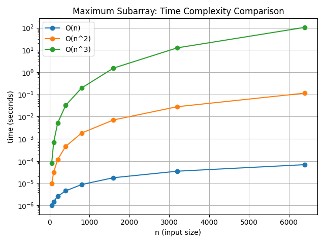

# Maximum subarray problem

*写于 2026-02-08*

最大连续和：给你一个整数数组 nums ，请你找出一个具有最大和的连续子数组（子数组最少包含一个元素），返回其最大和。

算法本身并不难。针对这个问题的优化，很适合用来理解复杂度分析。

在紫书第七章习题中，很多次我都是写完算法才发现复杂度超了。其实应该让估算复杂度前置，在编程之前估计程序的时空开销。

## 最大连续和 - O(n³)

最直观思路是暴力枚举起点，终点，计算起点和终点之间的和。

算法包含 3 重循环，根据上界分析：i 层最坏情况下需要循环 n 次，j 层循环最坏情况下也需要 n 次，k 层循环最坏情况下仍然需要 n 次。渐进时间复杂度看的是“增长情况”，因此总运算次数不超过 n³

做个实验，看看 n 扩大两倍时运行时间是否近似扩大 8 倍：

```c++
// 最大连续和(1)
#include <iostream>
#include <vector>
using namespace std;
using namespace chrono;

void calculate(int n, const vector<int> &A) {
  long long best = A[0];

  for (int i = 0; i < n; i++) {
    for (int j = i; j < n; j++) {
      int sum = 0;
      for (int k = i; k <= j; k++) {
        sum += A[k]; // 核心操作
      }
      if (sum > best)
        best = sum;
    }
  }
}
int main() {
  for (int n : {2000, 4000, 8000}) {
    vector<int> A(n, 1);

    auto start = high_resolution_clock::now();
    calculate(n, A);
    auto end = high_resolution_clock::now();
    double t = duration<double>(end - start).count();
    cout << "n = " << n << ", time = " << t << " s\n";
  }
}
```

编译的时候不要开 O2 优化：

```bash
➜  suanfajingsai git:(main) ✗ g++ -g -O0 -std=c++11 Ch8/example/8-1.cpp
➜  suanfajingsai git:(main) ✗ ./a.out                                  
n = 2000, time = 3.68404 s
n = 4000, time = 24.7283 s
n = 8000, time = 201.991 s
```

多次改变 n 值，确实是 n *2，速度 * 8 倍的关系。

## 递推 - O(n^2)

三重循环里重复计算了大量区间和。

递推的思路是，把「连续子序列之和最大值」看成是「两个前缀和之差的最大值」。

```c++
// 最大连续和(2)
#include <iostream>
#include <vector>
using namespace std;
using namespace chrono;

void calculate(int n, const vector<int> &A) {
  long long best = A[0];
  // long long S[n]; // 在 C++中，数组大小必须是编译时常量
  vector<long long> S(n);
  S[0] = A[0];

  for (int i = 1; i < n; i++) {
    S[i] = S[i - 1] + A[i];
  }
  for (int i = 1; i < n; i++) {
    for (int j = i; j < n; j++) {
      best = max(best, S[j] - S[i - 1]);
    }
  }
}

int main() {
  for (int n : {2000, 4000, 8000}) {
    vector<int> A(n, 1);

    auto start = high_resolution_clock::now();
    calculate(n, A);
    auto end = high_resolution_clock::now();
    double t = duration<double>(end - start).count();
    cout << "n = " << n << ", time = " << t << " s\n";
  }
}
```

```bash
➜  suanfajingsai git:(main) ✗ g++ -g -O0 -std=c++11 Ch8/example/8-1-2.cpp
➜  suanfajingsai git:(main) ✗ ./a.out                                    
n = 2000, time = 0.0140621 s
n = 4000, time = 0.0536105 s
n = 8000, time = 0.171409 s
```

这个算法把“重复加法”变成了一次减法，直接把复杂度降了一维。复杂度优化为了 O(n^2)，速度快了不少。


## 递推优化 - O(n)

当 j 确定时，`S[j]-S[i-1]`最大 相当于 `S[i-1]`最小。因此只需要扫描一次数组，维护“目前遇到过的最小 S”即可。

```c++
// 最大连续和(2.1)
#include <iostream>
#include <vector>
using namespace std;
using namespace chrono;

int calculate(int n, const vector<int> &A) {
  vector<long long> S(n);
  long long prefix = 0;    // 当前 S[j]
  long long minPrefix = 0; // min{S[-1], S[0], ..., S[j-1]}
  long long best = A[0];
  for (int j = 0; j < n; j++) {
    prefix += A[j];
    best = max(best, prefix - minPrefix);
    minPrefix = min(minPrefix, prefix);
  }
  return best;
}

int main() {
  for (int n : {2000, 4000, 8000}) {
    vector<int> A(n, 1);

    auto start = high_resolution_clock::now();
    calculate(n, A);
    auto end = high_resolution_clock::now();
    double t = duration<double>(end - start).count();
    cout << "n = " << n << ", time = " << t << " s\n";
  }
}
```

```bash
➜  suanfajingsai git:(main) ✗ g++ -g -O0 -std=c++11 Ch8/example/8-1-3.cpp  
➜  suanfajingsai git:(main) ✗ ./a.out
n = 2000, time = 0.0001385 s
n = 4000, time = 0.000296 s
n = 8000, time = 0.000464375 s
```

## 分治法优化 O(n*logn)

1. 把序列分成元素个数尽量相等的两半
   
2. 分别求出完全位于左半或者完全位于右半的最佳序列
   
3. 求出起点位于左半、终点位于右半的最大连续和序列，并和子问题的最优解比较。
   
任意一个最大连续子数组，要么完全在左半，要么完全在右半，要么横跨中点。这是完备分类。在三个分类里找最大的连续序列，就是整体的连续序列。

这个思路好反直觉啊，复杂度是 O(n log n).

```C++
// 最大连续和(3)
#include <iostream>
#include <vector>
using namespace std;
using namespace chrono;

long long maxSubarray(int l, int r, const vector<int> &A) {
  if (l == r)
    return A[l];

  int mid = (l + r) / 2;

  long long leftBest = maxSubarray(l, mid, A);
  long long rightBest = maxSubarray(mid + 1, r, A);

  long long sum = 0, leftSuffix = LLONG_MIN;
  for (int i = mid; i >= l; i--) {
    sum += A[i];
    leftSuffix = max(leftSuffix, sum);
  }

  sum = 0;
  long long rightPrefix = LLONG_MIN;
  for (int i = mid + 1; i <= r; i++) {
    sum += A[i];
    rightPrefix = max(rightPrefix, sum);
  }

  long long crossBest = leftSuffix + rightPrefix;

  return max({leftBest, rightBest, crossBest});
}

int main() {
  for (int n : {2000, 4000, 8000}) {
    vector<int> A(n, 1);

    auto start = high_resolution_clock::now();
    long long ans = maxSubarray(0, n - 1, A);
    auto end = high_resolution_clock::now();
    double t = duration<double>(end - start).count();
    cout << "n = " << n << ", time = " << t << " s\n";
  }
}
```

```bash
➜  suanfajingsai git:(main) ✗ ./a.out                                    
n = 2000, time = 0.000135125 s
n = 4000, time = 0.000281208 s
n = 8000, time = 0.000592625 s
```

## 一点延伸 - matplotlib 画图

在做 OSTEP 作业的时候，我看到有人用 matplotlib 画折线图。
我想，这个最大连续和的例子也特别适合用 matplotlib 画一下，把不同算法对于同样大小的数据复杂度提现出来。

横坐标是输入规模 n，纵坐标是运行时间。

在 llm 的帮助下我得到：



代码在：https://github.com/iynewz/suanfajingsai/tree/main/Ch8/example/8-1

这里有一些学到的：

- 使用对数纵轴。如果不写 `plt.yscale("log")`, 默认就是线性坐标。因为 `O(n³)` 纵轴太大了，会把其他曲线压扁。对数纵轴，曲线的斜率怎么看呢？ x 每 +1，y 乘 10^k。在对数纵轴，看的是横向走同样的 Δx，纵向跨了几个数量级

- `run.sh` 开头的 `#!/bin/bash` 这一行叫 shebang，它告诉操作系统：这个文件要用哪个解释器（bash，python3 等）来执行。在执行之前，先 `chmod +x` 赋予执行权限。

- 在安装 matplotlib 的时候遇到报错 `“× This environment is externally managed”`。意思是这个 Python 是 Homebrew 在管的，我不能直接往里 pip install。推荐工作流：每个项目创建独立的虚拟环境，在环境中用 pip 安装所需包。

    ```
    macOS
    └── Homebrew Python 3.13
            └── venv (.venv)
                └── matplotlib
    ```