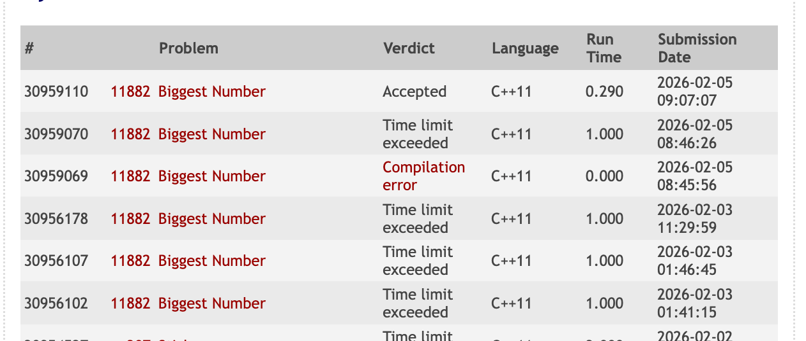

# UVa11882 Debug 笔记：剪枝

*写于 2026-02-05*

**习题 7-15 最大的数 (Biggest Number, [UVa11882](https://onlinejudge.org/external/118/11882.pdf))**

**题意：**在一个 R 行 C 列 (2≤R, C≤15, R*C≤30) 的矩阵里有障碍物和 1~9 的数字。
你可以从任意一个数字格出发，每次沿着上下左右之一的方向走一格，但不能走到障碍格中，也不能重复经过一个数字格，然后把沿途经过的所有数字连起来。问：连起来能得到的最大整数是多少?

**思路：**

为了找到最大的数，第一个优先的是：一定要把尽量多的数字都用上。其次优先的是：尽量让大的数字开头。

最大的数最多 30 位，不能用 int 存了，要用字符串。

对每个数字格作为起点，BFS 搜索？不对，应是 DFS。BFS 在扩展时，会按层展开，所以先得到较短路径。但较长的数字串一定比任何较短的数字串更优。

第一次代码 TLE 了。应该从哪里入手解决？第一步是估算时间复杂度：

复杂度 = 状态数 × 每个状态的分支数 × 每步的代价

枚举所有起点状态数：RC （RC 是有几个格子） 

每个起点 Dfs ，dfs 的状态数，看的是每个格子访问 / 不访问。因为 4 个方向，而且不能回头，算 3 个。3^RC

所以总状态数：RC * 3^RC

这时候 3 ^ 30 已经远超过 10  ^9 了，还没有算上每步的代价（字符串拷贝）

所以我的算法时间复杂度太大了，一定会 TLE。

## 学习题解：

[题解 1](https://blog.csdn.net/GoneWithTheWind_yin/article/details/77115901)：DFS 思路和我的一样，但是多一个：先对节点 BFS。

如何理解？h(x, y) 做的事情是，预估从 dfs(x, y) 的 (x, y) 出发作为起点，还可以拿到什么样的字符，这里可以得到一个乐观上届 upper bound。如果乐观上届都不可能超过当前的最优解，这个起点就不再 DFS 下去。

[题解 2](https://www.cnblogs.com/UniqueColor/p/4872790.html)

剪枝1 - 比长度: 也是 BFS ，int get_step = bfs(x, y);从当前点出发，在不经过 vis 的情况下，还能拿的最多字符数，这是一个乐观上届。即使未来所有能拿的格子全走一遍，字符串长度仍然不如当前最优解，就剪枝。- 这部分和上一道题解一样。

剪枝2 - 比排序：can[0..get_step-1]存所有可选字符的集合。则将所有还能到达的数字按从大到小排序后，连到当前数字上，这样就构造了一个最优上界。我们不关心最优上界实际是否可以走出来，只是用来剪枝，因为如果连最优上界还比目前最优解差，则剪去。

我学到的是，DFS 虽然看起来很好理解，RC 30 虽然看起来不大，但是实际上算一下复杂度竟然已经爆了。一次 BFS 扫一遍剩余可达区域是 O(n) 的，所以 BFS 剪枝很划算。

自己试了试，发现我只实现「剪枝1 - 比长度」的代码依然会 TLE。得两个剪枝都用上。


## 最后的 AC 代码

```c++
// TLE, Then i learned from https://www.cnblogs.com/UniqueColor/p/4872790.htm.
// Now AC
#include <algorithm>
#include <cstdio>
#include <cstring>
#include <iostream>
#include <queue>
#include <string>

using namespace std;
int R, C;
const int maxn = 15 + 5;
char grid[maxn][maxn];
bool visited[maxn][maxn];     // for dfs
bool visited_bfs[maxn][maxn]; // for bfs
int dir[4][2] = {{0, -1}, {1, 0}, {0, 1}, {-1, 0}};
int possible[30 + 5];
string best = "";

bool isBetter(const string &a, const string &b) {
  if (a.length() != b.length()) {
    return a.length() > b.length();
  }
  return a > b;
}

bool not_in_border(int r, int c) { return r < 0 || r >= R || c < 0 || c >= C; }

int bfs(int r, int c) {
  memset(visited_bfs, false, sizeof(visited_bfs));
  memset(possible, -1, sizeof(possible));

  queue<int> q;
  visited_bfs[r][c] = true;
  q.push(r * C + c);
  int length = 0;
  while (!q.empty()) {
    int tmp = q.front();
    q.pop();
    int cur_r = tmp / C;
    int cur_c = tmp % C;

    // cout << "--" << cur_r << r << "--" << cur_c << c << endl;
    for (int i = 0; i < 4; i++) {
      int new_r = cur_r + dir[i][0];
      int new_c = cur_c + dir[i][1];
      if (not_in_border(new_r, new_c)) {
        continue;
      }
      if (grid[new_r][new_c] == '#') {
        continue;
      }
      if (visited[new_r][new_c] || visited_bfs[new_r][new_c]) {
        continue;
      }

      possible[length++] = grid[new_r][new_c] - '0';
      visited_bfs[new_r][new_c] = true;
      q.push(new_r * C + new_c);
    }
  }
  return length;
}

void dfs(int r, int c, string cur) {
  int upper_bound = bfs(r, c);
  if (upper_bound + cur.length() < best.length()) {
    return;
  }
  if (upper_bound + cur.length() == best.length()) {
    sort(possible, possible + upper_bound); // 从小到大
    // cout << "possible: ";
    // for (int i = 0; i < upper_bound; i++) {
    //   cout << possible[i] << " ";
    // }
    // cout << endl;
    string tmp = cur;
    for (int i = upper_bound - 1; i >= 0; i--) {
      tmp += char(possible[i] + '0');
    }
    if (isBetter(best, tmp)) {
      return;
    }
  }

  //   cout << "cur " << cur << endl;
  visited[r][c] = true;

  for (int i = 0; i < 4; i++) {
    int newr = r + dir[i][0];
    int newc = c + dir[i][1];
    if (not_in_border(newr, newc)) {
      continue;
    }
    if (visited[newr][newc] || grid[newr][newc] == '#') {
      continue;
    }
    if (isBetter(cur + grid[newr][newc], best)) {
      best = cur + grid[newr][newc];
    }
    dfs(newr, newc, cur + grid[newr][newc]);
  }
  visited[r][c] = false;
}
int main() {

  while (scanf("%d %d", &R, &C) == 2 && R != 0) {
    // cout << R << "-" << C << endl;
    best = "";

    for (int r = 0; r < R; r++) {
      scanf("%s", grid[r]);
    }

    for (int r = 0; r < R; r++) {
      for (int c = 0; c < C; c++) {
        if (grid[r][c] != '#') {
          memset(visited, false, sizeof(visited));
          string start = string(1, grid[r][c]);
          //   cout << "start " << start << endl;
          dfs(r, c, start);
        }
      }
    }
    cout << best << endl;
  }

  return 0;
}
```

## 总结

* DFS 复杂度是指数级的，如果 DFS TLE 了，需要继续考虑怎么剪枝。
* 既然题目给了判断优先级的两个维度（长度、排序），这两个维度都可以去剪枝。


