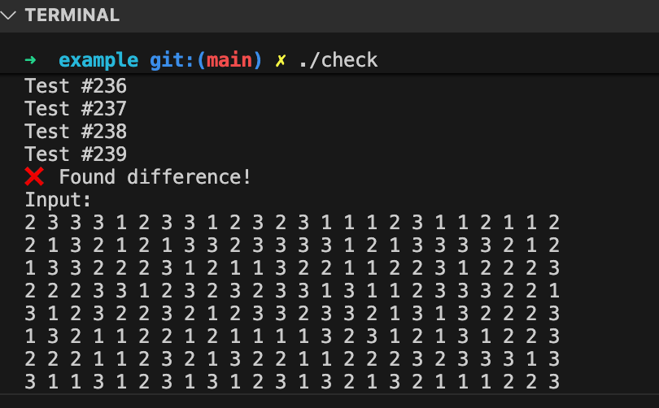

---
tags:
  - C++
  - Debug
---

# UVa1343 Debug 笔记：百爪挠心就对拍

**例题 7-12：旋转游戏 (The Rotation Game, [UVa1343](https://onlinejudge.org/external/13/1343.pdf))**

题意：井字形的图上一共有 8 个 1、8 个 2、8 个 3。每次操作可以沿着 A~H 八个方向转动棋盘（原来的头变成尾，其余格子向头部移动一个位置）。目标是让中间的数字全部相同——求最少多少步能达成。

我采用 IDA* 的思路，每次加深限制，直到找到解。

## DFS 伪代码

```
dfs(op, deep):
    1. 计算启发式 h
    2. 如果 deep + h > maxd → 剪枝返回 false
    3. 若已达目标 → 返回 true
    4. 枚举 A~H 的操作 i = 0..7
           如果 i 是上次 op 的相反操作 → 跳过（避免来回循环）
           对 a[] 执行 move(i)
           记录操作
           递归 dfs(i, deep+1)
           回溯（恢复 a[] 和 record）
```

## 启发式函数 h

h = “中间 8 格里，需要被修正的格子数”。

因为中间 8 格最终必须全部相同，因此只需统计出现次数最多的那个数字，剩下的格子都至少需要 1 次操作才能修正，所以：`h = 8 - max_count`

这是一个正确的 lower bound。只要 h 大于实际剩余步数，就说明无论如何无法达成，就能剪枝。


## 我的 Wrong Answer 代码

```c++
#include <cstdio>
#include <vector>
#include <algorithm>

using namespace std;
const int maxn = 7 * 7 + 5;
int a[maxn] = {0};
vector<int> record; // 开多大？题目没说
int target;         // 1, 2, 3
int maxd;

vector<int> center = {17, 18, 19, 24, 26, 31, 32, 33};
vector<int> opposite_op = {5, 4, 7, 6, 1, 0, 3, 2};

int check_center() {
    int target = a[center[0]];
    for (auto i : center) {
        if (a[i] != target) {
            return -1;
        }
    }
    return target;
}

bool read() {
    scanf("%d", &a[3]);
    if (a[3] == 0) return false;
    scanf("%d %d %d", &a[5], &a[10], &a[12]);
    for (int i = 1; i <= 7; i++) scanf("%d", &a[14 + i]);
    scanf("%d %d", &a[24], &a[26]);
    for (int i = 1; i <= 7; i++) scanf("%d", &a[28 + i]);
    scanf("%d %d %d %d", &a[38], &a[40], &a[45], &a[47]);
    return true;
}

void test_print() {
    for (int r = 1; r <= 7; r++) {
        for (int c = 1; c <= 7; c++) {
            printf("%d ", a[(r - 1) * 7 + c]);
        }
        printf("\n");
    }
}

int getH() {
    int cnt[4] = {0};
    for (auto i : center) cnt[a[i]]++;
    int max_number = max({cnt[1], cnt[2], cnt[3]});
    return 8 - max_number;
}

void move(int op) {
    switch (op) {
        int tmp;
    case 0:
        tmp = a[3];
        for (int i = 0; i <= 5; i++) a[i * 7 + 3] = a[(i + 1) * 7 + 3];
        a[45] = tmp;
    case 1:
        tmp = a[5];
        for (int i = 0; i <= 5; i++) a[i * 7 + 5] = a[(i + 1) * 7 + 5];
        a[47] = tmp;
    case 2:
        tmp = a[21];
        for (int i = 16; i <= 21; i++) a[i] = a[i - 1];
        a[15] = tmp;
    case 3:
        tmp = a[35];
        for (int i = 30; i <= 35; i++) a[i] = a[i - 1];
        a[29] = tmp;
    case 4:
        tmp = a[47];
        for (int i = 5; i >= 0; i--) a[(i + 1) * 7 + 5] = a[i * 7 + 5];
        a[5] = tmp;
    case 5:
        tmp = a[45];
        for (int i = 5; i >= 0; i--) a[(i + 1) * 7 + 3] = a[i * 7 + 3];
        a[3] = tmp;
    case 6:
        tmp = a[29];
        for (int i = 29; i <= 34; i++) a[i] = a[i + 1];
        a[35] = tmp;
    case 7:
        tmp = a[15];
        for (int i = 15; i <= 20; i++) a[i] = a[i + 1];
        a[21] = tmp;
    }
}

bool dfs(int op, int d) {
    int h = getH();
    if (h > maxd - d) return false;

    if (d == maxd) {
        target = check_center();
        return target > 0;
    }

    int tmp[maxn];
    memcpy(tmp, a, sizeof(a));

    for (int i = 0; i < 8; i++) {
        if (opposite_op[i] == op) continue;

        move(i);
        record.push_back(i);

        if (dfs(i, d + 1)) return true;

        memcpy(a, tmp, sizeof(tmp));
    }
    return false;
}

int main() {
    while (read()) {
        int same = check_center();
        if (same > 0) {
            printf("No moves needed\n");
            continue;
        }

        for (maxd = 1;; maxd++) {
            record.clear();
            if (dfs(-1, 0)) break;
        }
        for (auto i : record) printf("%c", 'A' + i);
        printf("\n%d\n", target);
    }
    return 0;
}
```

## Debug 发现的错误

写完之后，我的输出明显不对，我浏览代码后发现了几个显而易见的 bug：

### 1. switch-case 忘记 break

> In C++, forgetting a break statement within a switch case leads to "fall-through" behavior. This means that after the code within the matching case is executed, the program will continue to execute the code in all subsequent case statements

没有 break 会导致 **case 0 执行完继续 case 1、2、3...**, 直接把所有操作连着做一遍。


### 2. 回溯没有恢复 record

导致 record 越积越长，这个错误也足够明显。

### 3. move() 的赋值方向写错（覆盖旧值）

经过以上 2 个修改之后，答案仍然不对。我本身就有点担心我 hardcode 的 move 写得太可疑了，进一步打印中间过程，确实是我的 Move 写错了。

例如：

```c++
for (int i = 16; i <= 21; i++)
    a[i] = a[i - 1];
```

这是顺序覆盖，会让 a[17] 用到被覆盖后的 a[16]。应该反向写：

```c++
for (int i = 21; i >= 16; i--)
    a[i] = a[i - 1];
```

修复以上问题，本地测试/[udebug](https://www.udebug.com/UVa/1343) 都正确，但 UVa OJ 依然 Wrong Answer。

## 如何继续 Debug？

此时的我已经百爪挠心，因为拿不到 OJ 的错误输入，我实际上是不知道错误发生在哪里的，更别提最小复现了。所以我反复在“我的代码好像没错 - debug 不出来太难受了”之间横跳。

其实现在回想起来，bug 本身只是一处 trivial 的输出漏洞（当然也很重要），这不过是 debug 经验不足带来的情绪波动和手足无措。冷静一下想想，我下一步应该如何 debug? 总得有些事情可以做吧。

我问 gpt 我的本地测试看起来是对的，OJ 是挂的，这种情况如何 Debug，gpt 建议我强制测试所有极限数据，也就是构造输入，把自己的代码和别人的 AC 代码放在一起看 diff.

后来我想起来经常在洛谷的评论区看到竞赛选手对拍，我也应该试一试。

我在 gpt 的帮助下写了对拍脚本：

### 对拍脚本

```c++
#include <iostream>
#include <fstream>
#include <cstdlib>
#include <string>
using namespace std;

int main()
{
    system("g++ -O2  data.cpp -o data");
    system("g++ -O2 -std=c++17  7-12-ac.cpp -o std");
    system("g++ -O2 -std=c++17  7-12.cpp -o my");

    for (int t = 1; t <= 20000; t++)
    {
        cout << "Test #" << t << endl;

        system("./data > input.txt");
        system("./std < input.txt > std.txt");
        system("./my < input.txt > my.txt");

        if (system("diff std.txt my.txt > diff.txt"))
        {
            cout << "❌ Found difference!\n";
            cout << "Input:\n";
            system("cat input.txt");
            cout << "\nYour output:\n";
            system("cat my.txt");
            cout << "\nCorrect output:\n";
            system("cat std.txt");
            break;
        }
    }
    return 0;
}
```


### 随机数据生成器（data.cpp）

构造输入数据的代码很简单，每一行是 24 个随机的 1， 2， 3，每个 case 100 行:

```c++
#include <iostream>
#include <cstdlib>
#include <ctime>
using namespace std;

int main()
{
    srand(time(0));

    const int LINES = 100;
    const int NUMS = 24;

    for (int i = 0; i < LINES; i++)
    {
        for (int j = 0; j < NUMS; j++)
        {
            int x = rand() % 3 + 1;
            cout << x;
            if (j + 1 < NUMS) cout << " ";
        }
        cout << "\n";
    }
    cout << "0\n";
    return 0;
}
```
编译运行 check.cpp, 程序会一直跑，直到发现错误，并打印。

还真的找到了！



对拍后 diff 结果：

```
162d161
< 3
```

动作 d 表示 delete，我的输出第 162 行不存在 “3”。查看输出，问题在这里：

```c++
if (same > 0)
{
    printf("No moves needed\n");
    continue;
}
```

忘记输出中心数字了……😭

因为测试数据中从未出现同中心数字的情况，所以一直没暴露，OJ 的输入才刚好命中。


## 总结

哎！虽然 bug 本身微小，但 debug 费了这么大一圈功夫。应该读题更仔细些。debug 的过程也算经验加加了：

* 仔细读题（No moves needed 后还要输出中心数字）
* switch case 一定要写 break
* 逆向赋值 vs 正向赋值要特别警惕
* 学会对拍