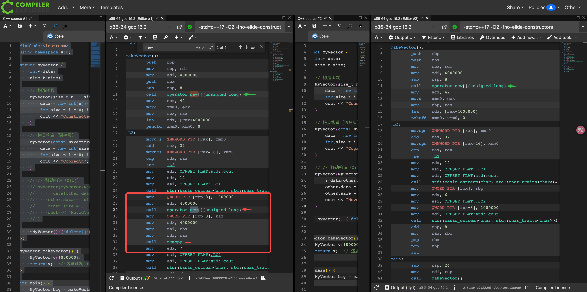

---
tags:
  - C++
  - Rvalue
  - Move 
---

# 13.6 从右值引用到 Move

## Rvalue References 右值引用
    
判断表达式是否是左值，有一个简单的办法，就是看看能否取它的地址，能取地址的就是左值。左值享有内存一个不变地址。

>A useful heuristic to determine whether an expression is an lvalue is to ask if you can  take its address. If you can, it typically is. If you can’t, it’s usually an rvalue.
    
右值引用（&&）的作用：区分“即将被销毁的对象”，从而安全、高效地“移动”资源，而不是拷贝。

为什么我们要在这里学 Rvalue References 的概念？和 move 有什么关系？从逻辑上，右值引用和 move 的关系是：为了提高效率，提出了 move 这一语义, 为了安全地移动资源，C++ 才不得不引入右值引用。


### C++11 之前的问题：语言无法表达“对象即将死亡”

在 C++11 之前，语言没有能力表达“临时对象”的概念，哪怕一个对象马上就要被销毁了，语言层面也无法区分。

```C++
Array makeArray() {
    Array a(1000000);
    return a;
}
```

a 在 return 之后就会被析构，但在 C++11 之前，编译器只能看到：`Array(const Array& temp_array);` 即使对象马上就要死了，也只能深拷贝，这对管理大资源的类型来说代价非常高。

于是有人提出用这种方式解决：

```C++
Array(const Array& temp_array, bool move) {
    data_ = temp_array.data_;
    size_ = temp_array.size_;
    temp_array.data_ = nullptr; //断开源对象与资源的关系，这样在 temp_array 析构时，就不会发生 double free。
}
```

这段代码意图是，既然后续不再需要源对象（`temp_array`）的资源，那么把源对象的资源移动过来，再清空源对象就行了。 

Array 的资源，本质就是一个指向一块动态分配堆内存的指针（`temp_array.data_`）、一个表示大小的 int. 那么把指针和大小复制出来，再断开源对象与资源的关系，就可以了。

虽然这个方案在“移动指针、大小”的思路上是正确的，但这种写法仍然是错误方案。在 C++11 之前，如果一个构造函数要“接受一个已有对象”，那么它的参数“只能”是 `const T&`。这个方案最大的错误是 `const Array&` 保证不修改这个对象的状态，但 const 的语义在 `temp_array.data_ = nullptr;` 这一步被破坏了。（还有其他不够好的地方，比如第二个 bool 参数是人为加的，不优雅）

### 右值引用的引入

于是，C++11 增加了右值引用：`T&&` ，绑定到“即将被销毁的对象”。

使用 std::move 可以将左值显式转换为右值引用。

```C++
Array b = std::move(a);
```

Array&& 在语言层保证 a 在这之后不再被使用。

目前，我们理解了，没有右值引用，无法区分“还要用的对象”和“马上销毁的对象”，move 是不可能被正确实现的。

## 手动实现 Move 的原理

为了理解为什么 move 高效，我们必须理解 Move 做了什么。之前已经接触到了 move 做的事情是复制指针的值，复制 size 大小，并清空源对象的指针。

我们可以手动实现一个简单的 MyVector 并观察移动构造：

```C++
#include <iostream>
using namespace std;

struct MyVector {
    int* data;
    size_t size;

    // 构造函数
    MyVector(size_t n) : size(n) { 
        data = new int[n]; 
        for(size_t i = 0; i < n; ++i) data[i] = 42;
        cout << "Constructed\n";
    }

    // 拷贝构造（深拷贝）
    MyVector(const MyVector& other) : size(other.size) {
        data = new int[size];
        for(size_t i = 0; i < size; ++i) data[i] = other.data[i];
        cout << "Copied\n";
    }

    // 移动构造
    MyVector(MyVector&& other) noexcept
        : data(other.data), size(other.size) {
        other.data = nullptr;
        other.size = 0;
        cout << "Moved\n";
    }

    ~MyVector() { delete[] data; }
};

MyVector makeVector() {
    MyVector v(1000000);
    return v;
}

int main() {
    MyVector big = makeVector();
}
```

### 观察拷贝构造与移动构造在汇编层面的差异

观察 [Godbolt snippets](https://godbolt.org/z/drcf7193T)，可以清楚地观察到拷贝构造与移动构造在汇编层面的差异。在 Godblot 里，采用 x86-64 gcc 15.2 编译器，编译选项 `-std=c++17 -O2 -fno-elide-constructors`. `-fno-elide-constructors` 的目的是禁用返回值优化，不然看不到 move 的效果。

试着把代码中“移动构造”的部分去掉或启用，可以看到对应输出 Copied 或 Moved. 

如果触发的是拷贝构造，在汇编层面一定会多出“从源对象数据区复制到目标对象数据区”的代码。

仔细看汇编代码的话，可以看到拷贝构造版本在 .L2 多了以下部分：



```
mov     QWORD PTR [rbp+8], 1000000
mov     edi, 4000000
call    operator new[](unsigned long)
mov     QWORD PTR [rbp+0], rax
mov     edx, 4000000
mov     rsi, rbx
mov     rdi, rax
call    memcpy
mov     edx, 7
```

可以看到对 operator new[] 的调用以及紧随其后的 memcpy，这表明编译器为目标对象重新分配了一块内存，并将源对象的数据逐字节复制过去！而 move 版本根本没有第二次 new, 也没有 memcpy.

### move constructor 必须是 noexcept，否则 STL 宁愿 copy

这里有一个细节 -- `noexcept`. `std::vector` 必须在发生异常时仍然保持原有数据不丢失，而一个可能抛异常的 move 无法提供这种保证。`noexcept`告诉库我们的 constructor 不会抛出异常。

vector 扩容 (`push_back`) 时，vector 做的是：分配一块更大的新内存；把旧元素搬到新内存；销毁旧内存。万一，move 前几个元素成功，move 某一个元素抛出异常。这样会有问题：前几个旧元素已被“move-from”，无法恢复到异常前的状态（因为 move 已经破坏了旧元素）。这违反了 vector 对用户的承诺：要么操作成功，要么容器状态不变（strong exception guarantee）。

对比一下 copy —— 即使 copy 失败了，原对象仍然完整。

所以我们设计 vector 容器的时候，给 move constructor 加了关键字 noexcept，只有当 T 的 move constructor 是 noexcept 时，vector 才能在扩容时使用 move；否则必须退化为 copy。

### vector 扩容时：什么时候 move，什么时候 copy？

vector 怎么知道什么时候 move，什么时候 copy 呢？。

一开始，我以为这是编译器自动通过 overload 决定的，比如

```C++
T(T&&);          // move ctor
T(const T&);     // copy ctor
```

但 overload resolution 只能决定“单个对象”该调用哪个构造函数，它无法决定一个容器在“批量迁移元素”时采用哪种整体策略。而 move 成功过的元素会被掏空，这是不可逆的，所以必须在整体迁移开始之前判断要用哪个操作。

这其实是 std::vector 内部显式写死的逻辑：

```C++
if constexpr (std::is_nothrow_move_constructible<T>::value
              || !std::is_copy_constructible<T>::value) {
    // 使用 move 构造
    uninitialized_move(...)
} else {
    // 使用 copy 构造
    uninitialized_copy(...)
}
```

这部分已经非常深入了，可以有选择性地看一看 libc++ 的原码。