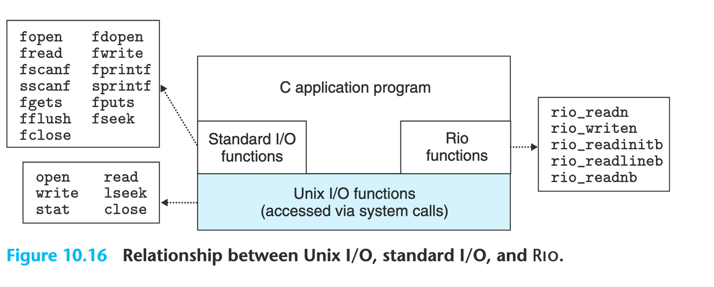
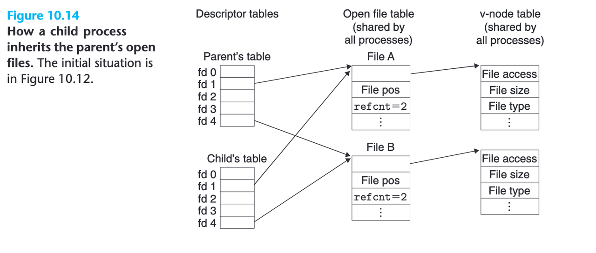

---
tags:
  - CSAPP
  - I/O
---

# System Level I/O
本章重点：如何正确使用 Unix/Linux 的底层 I/O，理解 Linux 内核如何管理文件（fd / open file table / vnode）。

## 学习目标
* [x] 能写出 robust read/write
* [x] 能解释 short count 发生原因
* [x] 画出 descriptor table → open file table → v-node table 的结构
* [x] 理解 fork 为什么共享文件偏移
* [x] 能解释为何网络 I/O 必须用 Unix I/O / RIO 而不是 stdio
* [x] 能解释为什么 stdio 对网络不安全（缓冲 + 格式化问题）
* [x] 能正确使用 dup2 实现重定向
* [ ] 实践：可以写一个 mini-cp 小项目

## Unix I/O



关于 Unix I/O, 最重要的是理解 unix 对 "file" 的抽象：everything is a file.

在操作系统和系统编程中，文件不仅仅指磁盘上的文件，它可以是任何文件对象（file object），包括：

* 磁盘文件
* 终端设备（tty）
* 网络 socket
* 管道（pipe）
* 其他特殊设备

Unix 的文件系统是树状结构，用 Directory hierarchy 的层次结构管理这些文件。无论真实底层是什么设备，都通过这个树结构把文件暴露给用户和程序。

每个新创建的进程都会自动继承某些“已经打开的文件描述符（File Descriptor）”，任何进程一开始，就自动拥有这 3 个打开的文件对象：stdin(fd = 0), stdout(fd = 1), stderr(fd = 2) 

???+ note "为什么 printf() 输出不需要调用 open()"

    shell 是一个进程，它有：stdin(fd = 0), stdout(fd = 1), stderr(fd = 2)这三个 fd。当你在 shell 输入 `./a.out`, shell 调用 fork() 创建程序进程，子进程会继承父进程所有打开的文件描述符。
    
    所以新程序也继承了：fd = 0, fd = 1, fd = 2

    所以 printf() 不需要 open, 可以直接写到 fd=1（stdout）。

### open & close

一个进程如何 open & close 文件?（注意 file 的概念是一切 object file，不仅用于普通文件，也适用于 socket、管道、设备等各种文件对象。）

在 Linux/C 中，进程打开文件通常调用：

```
int open(const char *filename, int flags, mode_t mode);
```

其中，filename 是要打开的文件路径；flags 是文件打开方式（读/写？）；mode 是文件权限（只在创建文件时生效）。

调用 open() 后，系统会返回一个 整数 fd，代表该进程内部的文件描述符，用于后续的读写操作。

### fd 的分配规则

每个进程维护一个文件描述符表（fd table），表中记录了当前进程所有打开的文件。

open() 会从 fd 表 从 0 开始扫描，找到第一个没有被占用的槽位，返回这个最小可用的 fd

fd 并不是文件本身，而是一个索引，指向内核维护的文件表项。

文件表项中会记录：文件位置（offset）、访问模式（flags）、指向 vnode / inode 的指针

通过 fd，进程可以使用 read(), write(), lseek() 等系统调用操作文件。

### 关闭文件：close()

当进程不再需要访问文件时，需要关闭文件：

```
int close(int fd);
```

关闭文件会发生：

* 释放 fd 表中的槽位

    使该 fd 可以被下一次 open() 使用

* 减少文件表项引用计数
  
    如果引用计数降到 0，内核会释放与文件对象相关的资源（缓冲区、锁等）

* 刷新缓冲区（对写文件）
  
    确保数据写入磁盘

关闭文件是系统资源管理的重要环节，如果忘记 close()，可能导致：fd 泄漏，系统可用文件数耗尽。

## Robust I/O

Higher-Level I/O 目的是提供缓冲读写，减少对内核的系统调用次数。常见形式有 RIO 和 Standard I/O。

Robust I/O 是 CSAPP 中封装的一套 高层次 I/O，它提供 缓冲读写，目的是减少对内核的系统调用次数，并解决一些 Unix I/O 在实际开发中容易遇到的问题。

为什么需要 RIO？

Unix 系统调用如 read() 和 write() 在遇到网络或设备 I/O 时，可能出现 short count，也就是系统调用返回的字节数比请求的少。

如果直接使用 read() 或 write()，程序需要手动循环处理这些情况 ` while (left > 0)` 。

RIO 封装了这种循环逻辑，保证应用程序读取到预期数量的字节。

rio_readn 是要么给你 n 字节，要么 EOF/出错。

rio_writen 是要么写完 n 字节，要么出错。

```C++
#include <unistd.h>
#include <errno.h>
#include <sys/types.h>

/* rio_readn: try to read n bytes from fd into usrbuf.
 * Returns:
 *   >0 : actual number of bytes read (can be < n only on EOF)
 *    0 : EOF (only possible if n==0 or encountered EOF immediately)
 *   -1 : error (errno set)
 */
ssize_t rio_readn(int fd, void *usrbuf, size_t n) {
    size_t nleft = n;              /* bytes left to read */
    ssize_t nread;                 /* bytes read by last read() */
    char *bufp = usrbuf;           /* current position in user buffer */

    while (nleft > 0) {
        nread = read(fd, bufp, nleft);
        if (nread < 0) {
            if (errno == EINTR)   /* read was interrupted by signal */
                nread = 0;        /* retry the read */
            else
                return -1;        /* other error -> give up */
        } else if (nread == 0)    /* EOF */
            break;                /* stop reading */
        nleft -= nread;
        bufp += nread;
    }
    return (ssize_t)(n - nleft);   /* return how many bytes we actually read */
}

/* rio_writen: write exactly n bytes from usrbuf to fd.
 * Returns:
 *   >0 : number of bytes written (should be n on success)
 *   -1 : error (errno set)
 */
ssize_t rio_writen(int fd, void *usrbuf, size_t n) {
    size_t nleft = n;              /* bytes left to write */
    ssize_t nwritten;              /* bytes written by last write() */
    char *bufp = usrbuf;           /* current position in user buffer */

    while (nleft > 0) {
        nwritten = write(fd, bufp, nleft);
        if (nwritten <= 0) {
            if (nwritten < 0 && errno == EINTR) /* write interrupted */
                nwritten = 0;    /* retry */
            else
                return -1;       /* error */
        }
        nleft -= nwritten;
        bufp += nwritten;
    }
    return (ssize_t)n;             /* all bytes written */
}
```

## Standard I/O (higher-level)

我们常用的 C 标准库提供的输入输出函数，如 scanf, printf, fgets, fputs 等，是 standard I/O library 提供的 higher level 输入输出函数。

对比 Unix I/O, standard I/O lib 把打开的文件看成是 stream，并提供格式化输入输出。

???+ note "为什么网络不能使用 printf？" 

## 文件共享


一个文件可能被不同的进程以不同方式、不同时间打开、读写、关闭。

1. Descriptor tables：每个进程都有自己的一张 Descriptor Table。 每个 FD（文件描述符）不是文件是指向 file table entry 的指针
2. Open file table：一个“打开实例”的视角（offset, flags, refcount）
3. V-node table：文件的元数据（权限、大小、磁盘存储）
   
### fork() 与文件偏移

当父进程调用 fork() 创建子进程时，父子进程共享同一个内核文件表项。文件偏移量（file offset）是内核级共享的。

结果就是，父进程读写文件时，偏移量前进；子进程读写同一个 fd，也会影响偏移量！

如果希望父子进程互不干扰，需要各自 open() 文件，或在子进程里 dup()/close() 后重建 fd