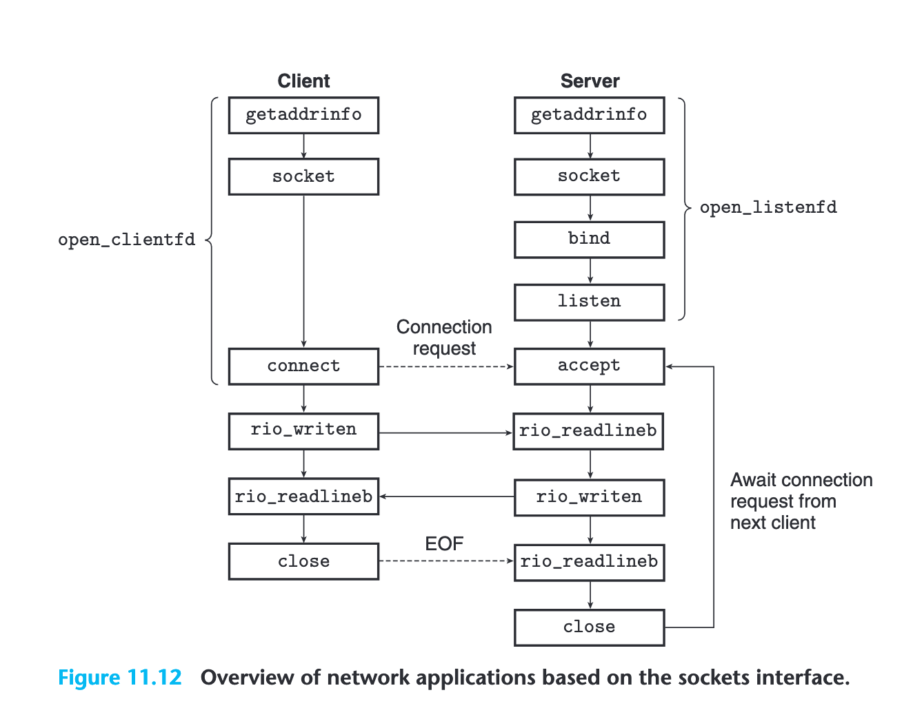

---
tags:
  - CSAPP
  - Network
---

# Network Programming

## 学习目标
理解网络程序的基本结构、客户端与服务器的交互方式，以及 socket API 的使用。最终，我们会跟着书上的步骤实现一个小型 Web server（TINY），以验证这些概念。

## Client–Server 模型
所有网络应用基本遵循 client–server 模型：

- Server：管理某种资源（文件、数据库、网页等），并等待客户端连接。
- Client：向服务器发起请求，并接收响应。

本质上，client 和 server 都是进程，通过网络进行通信。一次网络交互，就是两个进程按协议交换数据。

## Networks 相关背景
参考第六章 Connecting I/O Devices, Accessing Disks，这些概念对网络编程同样重要。

### DMA（Direct Memory Access）
网络设备与磁盘类似，可以通过 DMA 直接读写内存，无需 CPU 逐字节介入。

CPU 只在数据准备好时通过中断被通知。

网络设备、磁盘、终端等都遵循相似的 I/O 模型，因此网络通信可以视为一种特殊的 I/O。

### Socket 与 Connection
客户端和服务器通过 socket 接口创建连接。

Socket 是操作系统提供的通信端点。

一旦通过 socket API 建立连接，双方就可以像读写文件一样使用 read、write 进行数据交换。

### HTTP 协议交互
每台主机在物理上连接到某种网络，但全世界的网络技术多种多样：以太网、WiFi、4G/5G、光纤等，它们的帧格式、速率、传输长度和寻址方式都不同。那么，source host 是如何把数据可靠发送到使用完全不同网络技术的 destination host 的？

答案是：在每一台主机和路由器上，都运行着共同的协议软件，即 IP 协议层（网络层）。它统一了上层的视角，使不同物理网络能够互联。

### 静态与动态内容

* 静态内容
    
    服务器从磁盘读取文件，并返回给客户端。

* 动态内容
  
    服务器创建子进程执行某个程序，并将该程序输出作为 HTTP 响应返回。 

CGI 标准定义了：

- 客户端如何传递参数
- 服务器如何设置环境变量  
- 子进程如何生成输出并返回给客户端

## 互联网的组织方式与 TCP/IP 通信模型

互联网可以看作是一个全球范围互联的主机集合。不同主机之间的进程通过 TCP/IP 协议族进行通信。理解 TCP/IP、IP 地址、域名、端口号以及网络字节序，是学习网络编程的基础。

### TCP/IP 协议族
TCP/IP 不是一个协议，而是一族 (family) 协议，包括：

- IP (Internet Protocol)
  提供“把数据包从 A 主机送到 B 主机”的机制，但不保证可靠性：可能丢包、重复、乱序。

- UDP (User Datagram Protocol)
  基于 IP，为进程提供发送与接收数据的能力，但仍然不可靠。

- TCP (Transmission Control Protocol)
  在两个进程之间提供全双工连接 (duplex/bidirectional connections)，保证可靠、有序、无重复的数据传输。

这三层从底到上逐渐增强了可靠性与抽象程度，使应用程序在最终能够稳定地进行通信。

### 互联网的基本结构
可以将互联网理解为满足以下特征的一个巨大主机集合：

1. 每台主机都有唯一的 32 位 IPv4 地址。
2. IP 地址通常会映射到更易记忆的人类可读域名。
3. 不同主机上的进程可以通过连接（connection）进行通信。


### IP Addresses

一个 IPv4 地址本质上是一个无符号 32 位整数：

```c
struct in_addr {
    uint32_t s_addr;
};
```

早期 socket API 设计不优雅：其实直接用一个 32-bit int 就足够了，但历史原因导致结构体形式无法再被修改。

### 字节序与网络字节序

不同 CPU 有不同的字节序（big-endian 或 little-endian）。直接把整数发送到网络上时，不同主机会因为解释规则不同而出现冲突。

因此，TCP/IP 统一规定：所有网络传输的整数必须使用大端序（network byte order）。

### Internet Domain Names

DNS 维护域名与 IP 地址之间的映射关系。

现实中非常常见的情况是：多个域名映射到多个 IP 地址，原因包括：

1. 负载均衡 - DNS 可以轮询返回不同 IP，让客户端连接到不同服务器，减轻单点压力。

2. 提高可靠性 - 某个服务器宕机时，DNS 可以返回其他可用 IP。

这种“一对多、多对多”的映射形式使互联网具有高可用性与可扩展性。

### Internet Connections

进程之间的通信不仅由 IP 地址决定，还涉及端口号。端口号用于区分同一主机上的不同进程。

* 客户端端口：临时端口（ephemeral port）

    当客户端向服务器发起连接时，内核自动分配一个临时、高位的未使用端口（通常 >= 49152）。
    连接结束后，这个端口会被释放。客户端只需要端口能唯一标识连接即可，因此使用临时端口最方便。

* 服务器端口：well-known ports

    服务器必须在一个固定端口上监听，使客户端知道应该连接到哪里。

可以通过以下命令查看系统中已知服务与端口的对应关系：

```bash
cat /etc/services | grep http
```

## The Sockets Interface

Socket Interface 是 Unix I/O 的扩展，用于构建网络程序。




## Socket API：客户端与服务器的交互流程

### 客户端流程

客户端创建 socket，并主动连接服务器：

```c++
socket() // 创建 socket，返回 socket descriptor
connect() // 发起 TCP 三次握手，连接服务器。同时隐式完成：本地端口分配，本地地址绑定
read/write() // 连接建立后即可像文件一样读写
close() // 关闭连接
```

### 服务器流程

服务器需要提前监听：

```c++
socket() // 创建监听 socket（serverfd）
bind() // 绑定到固定端口，例如 80
listen() // 将 socket 设为监听状态
accept() // 阻塞等待客户端连接，返回新的 connfd
read/write() // 在 connfd 上与客户端通信
close() // 关闭 connfd（监听 socket 一般不关闭）
```

### 客户端 socket 的生命周期

当客户端调用：

```
int clientfd = socket(...);
```

此时得到的 `clientfd` 是一个未完全打开的 socket，不能直接读写。必须调用 `connect()` 才能完成初始化。

#### connect() 做三件事：

1. 自动绑定本地地址与一个临时端口（ephemeral port）  
   内核自动分配，无需手动 bind。

2. 发起 TCP 三次握手。

3. 握手成功后，socket 完全打开 → 可以 read/write。

完成连接后：

```
read(clientfd, ...)
write(clientfd, ...)
```

即可进行双向通信。


### 服务器 socket 的生命周期

服务器端的 `serverfd = socket()` 也只是半成品，必须依次调用 bind、listen、accept。

#### bind()

服务器要在固定端口监听，因此必须手动绑定：

`bind(serverfd, server_addr)`

#### listen()

将 serverfd 标记成“被动监听 socket”，准备接受连接：

```
listen(serverfd, backlog)
```

#### accept()

accept() 非常关键，它完成：

1. 阻塞等待客户端调用 connect()  
2. 完成 TCP 三次握手  
3. 创建一个新的 socket：`connfd`  
4. 返回 connfd（用于真正的数据读写）

服务器典型结构：
```
serverfd = socket(...)
bind(serverfd, ...)
listen(serverfd, ...)
connfd = accept(serverfd) // connfd 才能 read/write
read(connfd, ...)
write(connfd, ...)
```

serverfd 只用于监听，connfd 用于通信。

### Host and Service Conversion

在 socket API 中，许多函数都需要使用 sockaddr 这样的地址结构体。

getaddrinfo 的作用是：把主机名和服务名转换为一个或多个可用的 IPv4/IPv6 地址及端口信息。

相反，getnameinfo 则做逆向转换：从一个 sockaddr 结构中提取出对应的主机名和服务名（字符串）。

以浏览器访问 http://127.0.0.1:8000 为例：

- 127.0.0.1:8000 是服务器地址。
- 客户端是浏览器，它会用一个自己的临时（随机）端口，比如 53421，来连接服务器的 8000 端口。
- 对服务器来说，它只知道自己在监听 8000；但是完全不知道是谁来连接、从什么地址来连接。谁告诉服务器“客户端是谁”？并不是应用层告诉服务器的，而是 TCP 协议栈在 accept() 返回时提供的。
- 因此必须在 accept() 之后，服务器才能知道客户端的地址信息。


练习 11.4：inet_ntop 加 sockaddr_in 等传统写法比较繁琐。getnameinfo 可以完全替代 inet_ntop 的功能，让地址转换更简单、更通用（IPv4/IPv6 都支持）。


### 辅助函数（helper functions）

书里常用几个辅助函数来封装完整的 socket 创建流程：

```
int fd = open_clientfd(host, port);
int listenfd = open_listenfd(port);
```

这些函数会返回已经完全准备好的 socket 描述符（client socket 或 listening socket）。

之后就可以直接用 Unix I/O 接口（read/write/close）来收发数据，不需要手写 socket → bind → connect/listen → accept 的流程。

理解程度：暂时只需要知道它们内部已经完成了所有 socket 步骤，并知道返回的 fd 可直接使用即可。重点是理解 socket 生命周期，而不是记辅助函数内部细节。

## Web 服务器

Web 服务器处理 URL 的目标是——把 URL 映射为“一个字节流（内容）”并发送给客户端。  

获得这个“字节流”的方式主要有两类：

1. 从磁盘上读取静态文件  
2. 执行可执行文件或脚本，返回其输出（就是 CGI 的工作流程）  

这里详细介绍 CGI（Common Gateway Interface）：

- **CGI 程序**是放在服务器端的可执行程序。当客户端浏览器访问某些 URL 时，Web 服务器的流程如下：
  1. `fork` 一个进程  
  2. `exec` CGI 程序  
  3. CGI 程序接收环境变量（如 `REQUEST_METHOD`、`QUERY_STRING` 等）和标准输入  
  4. CGI 程序通过标准输出（stdout）写回 HTML/JSON 等内容  
  5. 服务器再把输出发送给客户端（浏览器）  

现代 Web 框架（如 Flask、Django、Node.js）也是基于类似思想，只是实现方式更现代化。

访问 URL 时，服务器的处理逻辑如下：

- 如果服务器配置将 URL path 映射为静态本地文件，则直接从磁盘读取静态文件  
- 如果服务器发现访问的路径下是 CGI 程序，则走上述 CGI 流程  


### Common Gateway Interface (CGI)

CGI 是一种标准，规定了：

1. 服务器如何把 HTTP 请求转成程序的输入  
2. 程序如何把输出转成 HTTP 响应  

也就是说，CGI 规范了程序如何参与网络协议。  

举例：假设有一个程序 `adder` 用于计算 3+5 并返回结果 8。  

访问方式：`http://example.com/adder?x=3&y=5`

那么就会遇到问题：参数 `x=3, y=5` 如何传给程序？程序的输出油如何发送回客户端？  

CGI 就规定了这些规则。  

本质上，执行一个程序、程序打印 HTML、返回给浏览器，这就是最原始的 Web 后端。

## HTTP Transactions - 一次 HTTP 事务

一个 HTTP transaction 包括：

- 客户端发送 Request
- 服务器发送 Response

### HTTP Request 格式

```
<method> <uri> <version>
<header lines> 
(blank line)
[optional body] 
```

注意：HTTP 协议不要求必须写 <html> 标签，浏览器同样可以正确显示内容，例如这样就是正确的：

```
Content-type: text/html

Hello
```


### HTTP Response 格式
```
<version> <status code> <status message>
<header lines>
(blank line)
[body]
```


## Tiny server
最后，我们要实现一个 Tiny server. 如果不动手自己实践一边的话，还是觉得似懂非懂。

详见：[Tiny Server](./11-server.md)