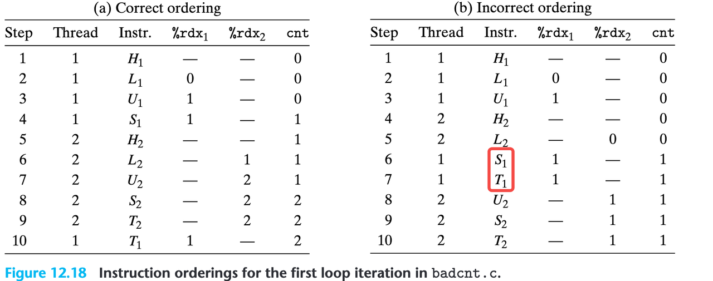
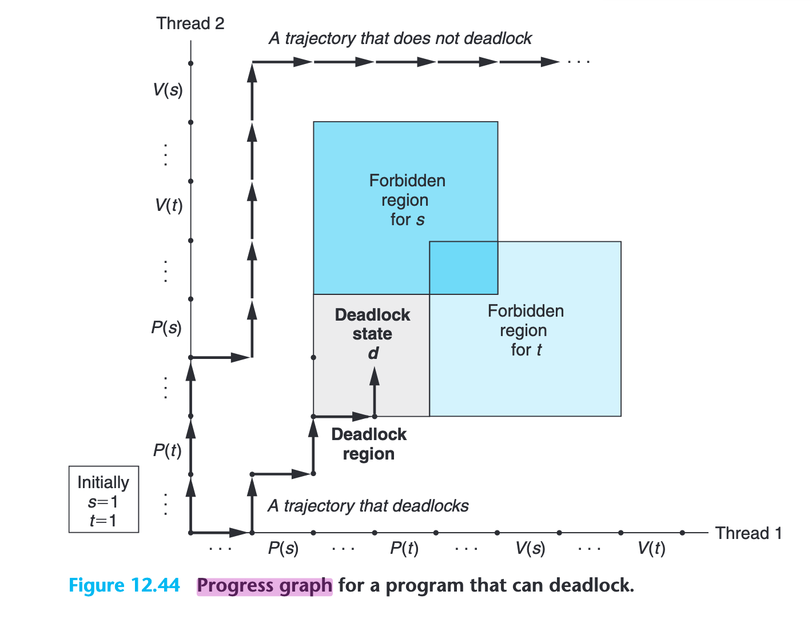

---
tags:
  - CSAPP
  - Concurrency
---

# Concurrent Programming

为什么要学并发编程？学习并发，不只是因为“有多核 CPU，可以更快”。现实世界本身就有同时发生的需求：网络请求同时到来、后台任务同时进行、UI 同时响应事件、存储系统同时读写。理解并发才能理解现代软件的真实世界。更重要的是，并发是理解“系统”的入口。

## 用多进程实现并发

在第 11 章，我们实现了一个 Tiny Server，它能够顺序处理一个 HTTP 请求。但在真实世界中，这显然是不够的——现代服务器必须能够同时处理多个客户端请求。

最早、也是最直接的并发实现方式，是通过 fork() 创建多个进程，让每个进程独立处理一个请求。父进程负责 Accept 新的连接，子进程负责处理具体请求。

```c
while (1) {
    clientlen = sizeof(struct sockaddr_storage);
    connfd = Accept(listenfd, (SA *) &clientaddr, &clientlen);

    if (Fork() == 0) {  // Child process
        Close(listenfd);    // Child 不再监听 -> ref count 减 1
        echo(connfd);       // Child 处理客户端
        Close(connfd);      // Child 关闭客户端 -> ref count 减 1
        exit(0);            // Child 退出
    }

    Close(connfd);          // Parent 关闭已连接套接字 -> ref count 减 1
}
```

复习一下（第 10 章），每个进程有自己的文件描述符表 fd table，每个 fd 指向 file table entry。ref count 记录了有多少个 fd 指向这个文件表项。只有当引用计数变为 0，内核才真正关闭套接字。
每个不使用的进程都必须关闭它持有的套接字，否则引用计数永远不为 0，资源不会释放。除非进程退出，操作系统会自动关闭它持有的所有 fd.

Problem 12.2: 为什么父进程不关闭 connfd 也不会造成内核“内存泄漏”？- 因为操作系统会在父进程退出时回收 fd。

## 用 I/O Multiplexing 实现并发

前面的例子使用多进程实现并发，这基于一个大前提：必须有进程在等待另一个进程的 I/O。

如果有多个事件同时发生，单独阻塞等待一个事件会导致导致其他事件无人处理。 

这时就需要 I/O 多路复用（I/O Multiplexing）。它的核心思想是：用一个进程同时监听多个 I/O 事件，只有当某个事件真正可以处理时，才去处理它。select/ poll/ epoll 就是这种思路的典型代表。

### select

select 的实现本质上是依赖一个 fd_set，它可以看作一个 bit 数组：每一位（bit）对应一个文件描述符（fd）。程序使用它来告诉内核“我关心哪些 fd 的读事件”。

Select 的实现方式是：

1. 程序先定义一个 fd_set，并将需要监听的 fd（如 stdin、监听 socket）在这个集合中对应的位置置为 1。
   
2. 在主循环里：
     1. 因为 select 会修改传入的集合，所以在每次循环中都要把 read_set 复制到 ready_set。
   
     2. 等待事件发生
   
     3. 根据“留下的 bit”处理就绪事件
   
内核把只有那些真的可读的 fd 留下，其余的都清零；程序根据这些“被留下的 bit”处理事件；这样就完成了“一次性监控多个 IO”。

```c
while (1) {
    ready_set = read_set;
    Select(listenfd+1, &ready_set, NULL, NULL, NULL);

    if (FD_ISSET(STDIN_FILENO, &ready_set)) {
        // 处理用户输入
    }

    if (FD_ISSET(listenfd, &ready_set)) {
        // 处理新的客户端连接
    }
}
```
通过这种方式，一个进程就能同时等待多个 I/O 事件，这就是 I/O 多路复用的核心。

### select → poll → epoll 的进化

1. select 的局限

    最早的 select 使用固定大小的 fd_set，本质是一个 bit 数组，能监听的文件描述符数量被硬限制在 FD_SETSIZE（通常 1024）以内。更糟糕的是，每次调用 select 都需要把整个 fd_set 从用户态拷贝到内核态，内核再对所有 fd 做一次线性扫描，判断哪些就绪。无论真正发生事件的 fd 有多少，开销都是 O(n)。

2. 进化到 poll

    poll 用 struct pollfd 数组替代了 select 的位图结构，从而摆脱了 1024 的限制，可以监听几千甚至几万个 fd。但内核仍需要遍历所有 fd（O(n)）。

    ```c
    struct pollfd {
        int fd;
        short events;
        short revents; // 内核写入事件
    };
    ```
3. 进化到 epoll

    epoll 的出现带来了真正意义上的质变。它引入“事件通知”机制：把 fd 和关注的事件一次性注册到内核（epoll_ctl），之后内核维护一个就绪列表，只有真正发生事件时才把对应 fd 推入队列。这样在等待事件时，应用程序的处理复杂度接近 O(1)，不再需要重复扫描所有 fd
    
    整体演进非常类似“从浏览器不断轮询某个接口”到“服务器主动推送 Webhook”，从主动轮询转变为被动接收事件，性能和扩展性都有质的提升。


## 线程 API - Pthreads

Pthreads 是在 C 程序中处理线程的一个标准接口，Pthreads 定义了大约 60 个函数，允许程序创建、杀死和回收线程，与对等线程安全地共享数据，还可以通知对等线程系统状态的变化。

一个简单的线程示例：

```c
#include <stdio.h>
#include <pthread.h>

void* worker(void* arg) {
    printf("Worker thread running\n");
    return NULL;
}

int main() {
    pthread_t tid;
    pthread_create(&tid, NULL, worker, NULL);  // 创建线程
    pthread_join(tid, NULL);                   // 等待线程完成
    printf("Main thread done\n");
    return 0;
}
```

关键函数说明：

* **`pthread_create`**：创建一个新线程，但不保证线程立即开始执行。线程的调度由操作系统负责。
* **`pthread_exit`**：显式终止当前线程。当线程例程返回时，也会隐式调用 `pthread_exit`。
* **`pthread_join`**：阻塞调用它的线程（通常是主线程），直到指定线程终止。它类似于进程中的 `wait(pid)`，只是等待对象是线程而非子进程。
* **`pthread_detach`**：将线程设置为“分离状态”，线程终止后会自动释放资源，无需其他线程调用 `pthread_join`。

#### 为什么 Web 服务器例子里不想用 `pthread_join`？

在高性能 Web 服务器中，每当接收到一个浏览器连接，主线程就创建一个新线程来处理该连接。如果使用 `pthread_join`，主线程会被阻塞，直到线程完成处理，无法继续接收新的连接。

因此，更常见的做法是使用分离线程（detached thread），线程处理完成后自动释放资源，而主线程可以持续接收和调度新的连接。

---

## 线程与进程的区别

并发编程中，线程（Thread）和进程（Process）是两种基本单位。典型区别如下：

| 特性    | 线程            | 进程            |
| ----- | ------------- | ------------- |
| 内存空间  | 同一进程的线程共享内存   | 各自拥有独立内存空间    |
|   上下文切换开销  | 相对较小          | 相对较大          |
| 通信方式  | 直接共享内存        | 需要进程间通信（IPC）  |

由于线程共享地址空间，一个线程的内存错误（如越界写）可能破坏整个进程；而进程之间的错误通常是隔离的。


## 互斥与同步

同一进程的线程共享内存，但每个线程有自己独立的寄存器。访问共享变量的代码段被称为临界区（critical section）。如果多个线程交替 interleaving 执行临界区，就可能产生数据不一致的问题。

比如，在 CSAPP 12-16 的例子里，两个线程都做共享变量 `cnt` 执行 `cnt += 1` 操作。`cnt += 1` 不是一个原子操作，而是由 3 条汇编指令组成：

```
movq cnt(%rip), %rdx   # Load: 将 cnt 的值加载到寄存器 rdx
addq $1, %rdx          # Update: 将寄存器 rdx 的值加 1
movq %rdx, cnt(%rip)   # Store: 将 rdx 的值写回 cnt
```

由于 CPU 在执行这些指令时可能发生线程切换，如果两个线程交替执行临界区，就可能出现同步错误。

对应下图（b），假设线程 1 已经执行了 Load 和 Update，但尚未执行 Store，此时内核切换到线程 2（此时线程 1 的上下文被保存了）。切换到线程 2 的执行后，线程 2 加载的变量并没有被线程 1 改变过。那么当内核继续回到线程 1，CPU 恢复了线程 1 的上下文，把线程 1 寄存器 rdx 的值复制到变量上。

结果是，尽管 cnt += 1 被两个线程各执行一次，但 cnt 的实际增加值只有 1，这就是典型的同步错误。



为了确保每个线程正确执行它的临界区中的指令，不同线程访问共享变量应该是**互斥**的。

## 同步原语

### 信号量（Semaphore）

信号量是一种整数计数器，用来控制多个线程对共享资源的访问。主要操作有两个：

csapp.c 中封装的 P/V 操作（分别对应 wait/post）：

```
void P(sem_t *sem) 
{
    if (sem_wait(sem) < 0)
        unix_error("P error");
}

void V(sem_t *sem) 
{
    if (sem_post(sem) < 0)
        unix_error("V error");
}
```

P（Wait）操作：等待信号量，当信号量值 > 0 时，允许线程进入临界区，并将信号量减 1；如果值 = 0，则线程阻塞，直到信号量可用。

V（Post）操作：释放信号量，将其值加 1，如果有线程在等待，则唤醒一个线程。

信号量分为两种类型：

1. 二元信号量（Binary Semaphore）：值只能是 0 或 1。二元信号量可以用来保证同一时刻只有一个线程访问共享资源，那么这就是互斥锁（Mutex）的实现了。

2. 计数信号量（Counting Semaphore）：值可大于 1。计数信号量可用于控制 n 个线程对有限资源的并发访问。

### 互斥锁（Mutex）

互斥锁是信号量的特例，专门用于保护临界区。

加锁（lock）：线程请求进入临界区，如果互斥锁被占用，则线程阻塞。

解锁（unlock）：线程离开临界区，释放互斥锁，允许其他线程进入。

无论多少线程尝试访问共享资源，同时只能有一个线程真正进入临界区，从而保证数据一致性。


## 死锁（Deadlock）

死锁是指多个线程（或进程）在执行过程中，因为争夺资源而互相等待，导致所有相关线程都无法继续执行的状态。如果看进度图的话，死锁是因为每个线程都在等待其他线程执行一个永远不会发生的 V 操作。



从这张图里，我们可以看到不同的执行有不同的轨迹线。这也反应了死锁是一个相当困难的问题，因为它不总是可预测的。你可以运行一个程序 1000 次不出任何问题，但是下一次它就死锁了。因为一些执行轨迹线将绕开死锁区域，而有一些可能进入了死锁。

工程中最常见的死锁例子是：**thread1 持有资源 A，等待资源 B；thread2：持有资源 B，等待资源 A**，形成循环等待。

```c++
#include <mutex>
#include <thread>

std::mutex mtxA;
std::mutex mtxB;

void thread1() {
    std::lock_guard<std::mutex> lockA(mtxA);
    std::this_thread::sleep_for(std::chrono::milliseconds(10));
    std::lock_guard<std::mutex> lockB(mtxB);
    // ...
}

void thread2() {
    std::lock_guard<std::mutex> lockB(mtxB);
    std::this_thread::sleep_for(std::chrono::milliseconds(10));
    std::lock_guard<std::mutex> lockA(mtxA);
    // ...
}
```

???+ note "死锁产生的四个必要条件"

      1. **互斥条件（Mutual Exclusion）**
         资源是非共享的，一次只能被一个线程（或进程）占用。

      2. **占有并等待条件（Hold and Wait）**
         线程已占有至少一个资源，同时又申请新的资源，而该资源被其他线程占用。

      3. **不可剥夺条件（No Preemption）**
         已分配给线程的资源在未使用完之前，不能被强制剥夺，只能由线程主动释放。

      4. **循环等待条件（Circular Wait）**
         每个线程都在等待其他线程释放资源，而这种等待关系形成了循环，使得任何线程都无法继续执行释放操作


      这「四个条件」CSAPP 并没写，但经常能搜到，乍一看感觉比较八股文。出处是 Coffman 等人的一篇 [survey](https://dl.acm.org/doi/pdf/10.1145/356586.356588)


只有同时满足这四个条件，死锁才可能发生。只要其中任一条件不成立，死锁就不会发生。

死锁预防的核心思想也是打破上述四个必要条件中的至少一个。一一对应的方法比如：

1. 尽量将资源设计为可共享的，例如只读文件或读写锁。

2. 线程在开始执行前一次性申请所需所有资源。如果不能获取全部资源，则释放已占资源，稍后重试。

3. 当线程请求资源失败时，允许操作系统或程序强制回收已占资源，避免无限等待

4. 当使用二元信号量来实现互斥时，给定所有互斥操作的一个全序，如果每个线程都是以一种顺序获得互斥锁并以相反的顺序释放，那么这个程序就是无死锁的。