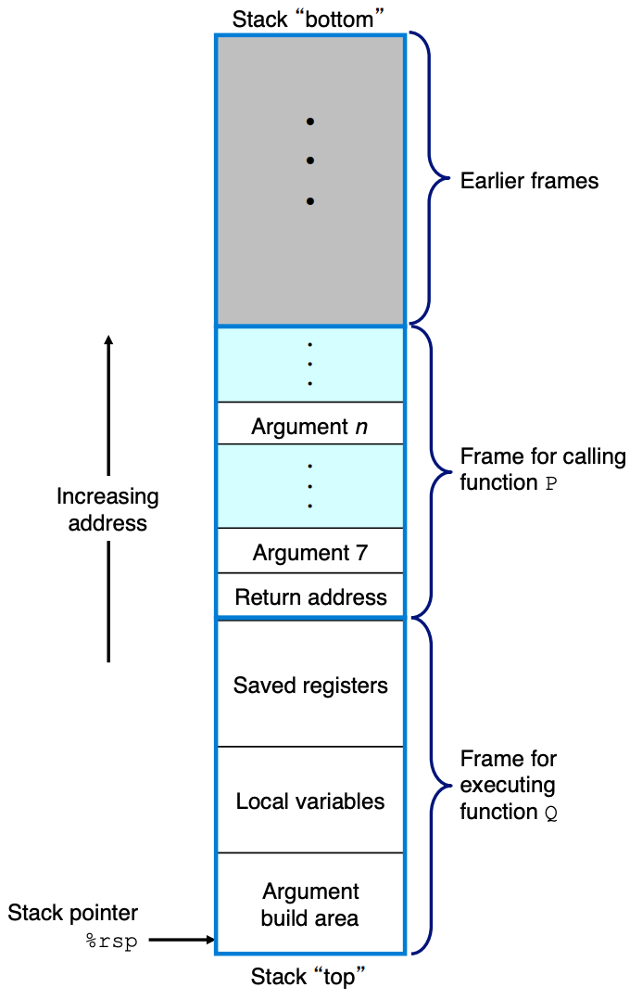

---
tags:
  - CSAPP
  - Assembly
---

# 程序的机器级表示

## Stack

栈（stack） 是一整块用于函数调用的内存区域与抽象数据结构。

```assembly
subq $8, %rsp     ; Decrement stack pointer
movq %rbp, (%rsp) ; store %rbp on stack
```

从栈顶到栈底，地址逐渐增大，subq $8, %rsp首先把栈指针减 8，然后把值写到新的栈顶。
上述指令做的事情是，把一个四字值压入栈里。
对应地，出栈就是从内存中读取数据，增加栈指针的值：

```assembly
movq (%rsp), %rax ; read %rax from stack
addq $8, %rsp     ; Inecrement stack pointer
```

%rax 仍然保存在内存位置里直到被覆盖。

## x86-64 函数调用时栈帧的构建过程

当 x86-64 过程需要的存储空间超过寄存器能存放的大小时，就会在栈上分配空间。这个部分称为过程的栈帧 (stack frame)，栈帧是一次函数调用在栈上占用的那一小段区域。

过程 P 调用过程 Q:


在一个过程调用另一个过程时，寄存器组是唯一被所有过程共享的资源。

如果没有规则约束，被调用者 Q 完全可能覆盖调用者 P 稍后还要使用的寄存器值，从而破坏程序的正确性，这正是 calling convention（调用约定）存在的原因。calling convention 稍后解释，先讲：

### 转移控制是如何发生的？

当控制从函数 P 转移到 Q 时，只需要把程序计数器 (PC, 在 x86-64 里用寄存器 RIP 存) 设置为 Q 代码的起始位置。Q 执行完后，处理器必须知道回到 P 的哪一条指令继续执行，这就依赖于 call / ret 指令以及栈帧。

1. call 在 x86-64 ISA 中是一条具有复合语义的原子指令。call Q 指令原子性地做**两件事**：
   
      1. 将返回地址压入栈中。返回地址是：call 指令的下一条指令地址
      2. 跳转到被调用函数 Q 的入口地址
    
    *复合语义的原子指令意思是，要么完整执行，要么完全不执行*

2. 被调用函数 Q 的栈帧构建（Prologue）
     
        ```
            Q:
        push rbp
        mov  rbp, rsp   ; 建立新的栈帧基址
        sub  rsp, N     ; 为局部变量分配空间
       ```

       rbp 指向当前函数栈帧的“锚点”

3. Q 执行完后会销毁自己的栈帧，释放局部变量空间：

        ```
        mov rsp, rbp
        pop rbp
        ret
        ```

4. ret 指令原子性地做两件事：
   
      1. 从栈顶弹出返回地址并更新 rsp
      2. 跳转回调用者 P, rip 被设置为刚刚弹出的返回地址
   
rsp 永远指向当前栈顶。在“被调用函数销毁自己的栈帧之后”，rsp 指向的就是之前压入的返回地址。

### Calling Convention

1. Caller-saved（调用者保存）
   
    调用者在调用前，如果还需要这些寄存器的值，就自己保存。
    
    常见 caller-saved 寄存器：

    ```
    rax  rcx  rdx
    rsi  rdi
    r8–r11
    ```

2. Callee-saved（被调用者保存）
    
    被调用函数如果要用这些寄存器，必须先保存，返回前恢复。调用者默认这些寄存器不会被破坏。
    
    常见 callee-saved 寄存器：
    
    ```
    rbx  rbp
    r12–r15
    ```
