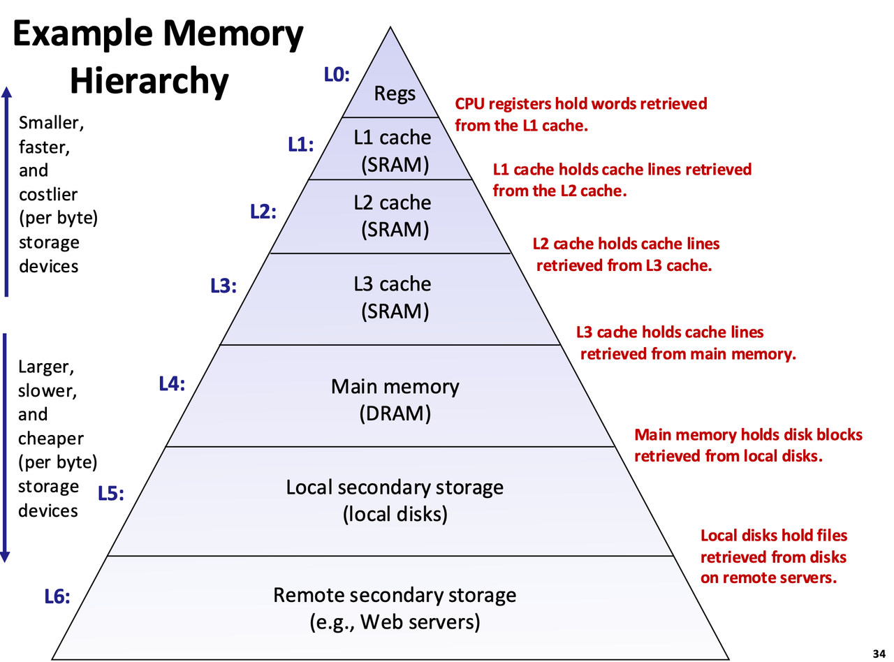

---
tags:
  - CSAPP
  - memory
  - cache
---

# Memory Hierarchy

现代计算机系统的核心矛盾之一，是 CPU 计算速度 与 存储系统访问速度 之间的巨大差距。存储器层次结构（Memory Hierarchy）正是为了解决这一“速度鸿沟”而设计的。

## 存储技术概览

1. SRAM（静态 RAM）
    1. 不需要刷新，速度快  
    2. 成本高、密度低  
    3. 主要用于 Cache（L1/L2/L3）
   
2. DRAM（动态 RAM）
    1. 需要周期性刷新 
    2. 延迟高于 SRAM，但成本更低
    3. 用作主存（Main Memory）

3. 总线 (Bus) 
   
      是计算机系统里一组共享的传输线路，能同时传输数据、地址和控制信号，让 CPU、内存、I/O 设备这些组件能互相通信。

## Locality of reference 访问局部性

2000 年代初，Intel 和 AMD 通过提升时钟频率来增强性能，但功耗（Power）和发热（Heat）呈指数增长，单核性能提升逐渐遇到物理极限。2005 年，Intel 推出首款双核 CPU。现代 CPU 朝着多核+异构方向演进，性能增长。

然而，内存访问速度的提升远远跟不上 CPU 执行速度。如果每条指令都等待内存，CPU 大部分时间都会在苦等。

弥合 CPU 和 内存之间的速度鸿沟，靠的是程序一个基本的、恒定的属性，叫做 locality

> Principle of Locality: Many programs tend to use data and instructions with addresses near or equal to those they have used recently.

1. 时间局部性（Temporal Locality）

    如果一个数据被访问，它很可能在短期内再次被访问。

    例子:

    ```c
      for (int i = 0; i < n; i++) {
      sum += a[i];
      }
    ```
    sum 变量在每次循环中被重复使用。CPU 会将 sum 保存在寄存器（最快的存储）或 L1 缓存，无需从慢速内存中重复加载。

    循环体（sum += a[i]）被多次执行。第一次执行后，指令会保留在 I-Cache 中，避免重复从内存读取。这体现了时间局部性。

2. 空间局部性（Spatial Locality）

    如果一个数据被访问，其邻近的数据也可能很快被访问。

    还是这个例子，数组 a[] 是按顺序访问的，步长为1（stride-1）。CPU 缓存以块（缓存行，通常64字节）为单位加载数据。当 a[0] 被加载时，相邻元素（a[1], a[2] 等）也会被预取到缓存中。后续访问（a[1], a[2]...）直接命中缓存，无需访问慢速的 DRAM。
    CPU 按顺序获取指令，指令缓存（I-Cache）会预取后续指令，提高执行效率。这体现了空间局部性。

## Memory Hierarchy



越靠近 CPU：越快，越小，越贵

越远离 CPU：越慢，越大，越便宜


## Cache 的工作方式

缓存命中 (Cache Hit)：CPU 要访问的块正好在 Cache 中。此时 CPU 可以直接从缓存中读取数据，速度远快于从 Main Memory 甚至更低层存储（如磁盘）读取。 L1 缓存仅需 1~4 个时钟周期。

与之对应的就是缓存未命中 (Cache Miss)：数据不在缓存中，需从主存或下一级缓存加载，延迟高（可能数百周期）。

局部性原理如何影响缓存设计? 局部性直接影响了以下设计决策：

1. 缓存行大小（Block Size）

    利用空间局部性，一次加载一整块数据，而不是单个字

2. 多级缓存（L1 / L2 / L3）

    利用时间局部性，热数据尽可能停留在更高层缓存

3. 替换策略（Replacement Policy）

    常见策略：LRU（Least Recently Used）

    核心思想：最近用过的数据，将来更可能被再次使用

4. 预取（Prefetching）

    基于空间局部性和访问模式预测，提前将可能访问的数据加载到 Cache


为什么缓存能有效提升程序性能？因为程序具有很强的时间局部性和空间局部性，而缓存用更小、更快的存储器保存“热点数据”，大多数访问都能在低延迟层完成。

[ ]## 三种缓存
