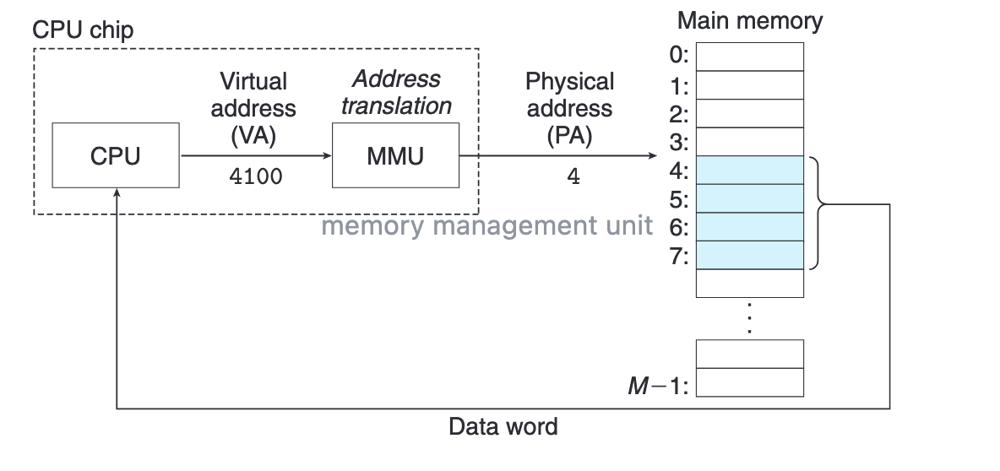
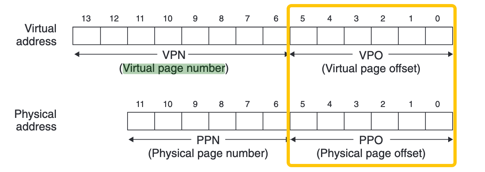

---
tags:
  - CSAPP
  - memory
---

# Virtual Memory

学这一章的目的：
理解虚拟地址空间、页表(Page Tables) 和 Multi-Level Page Tables、内存映射（mmap + 缺页异常）、动态内存分配。

真实的 main memory 资源有限、易受攻击。为了有效管理内存并且少出错，现代系统提供了一种对主存的抽象概念，叫做 Virtual Memory.

VM 提供 3 个能力：

1. 把主存看成磁盘上的 cache
2. 它为每个进程提供了一致的地址空间，从而简化了内存管理
3. 它保护了每个进程的地址空间不被其他进程破坏。
   
> three important capabilities: 
> 
> (1) It uses main memory efficiently by treating it as a cache for an address space stored on disk, keeping only the active areas in main memory and transferring data back and forth between disk and memory as needed. 
> 
> (2) It simplifies memory management by providing each process with a uniform address space. 
> 
> (3) It protects the address space of each process from corruption by other processes.

## 地址转换 Address Translation



地址转换是把 CPU 产生的虚拟地址 VA，映射成物理地址 PA 的过程，每次内存访问都会触发。这个过程是：

1. CPU 产生虚拟地址 VA
2. MMU 查 TLB
3. 若 TLB miss → 查页表（PTE）
4. 检查 PTE 的 valid/present 位
      - present = 1 → page hit
      - present = 0 → page fault

一步一步来：

### Step1. CPU 生成虚拟地址（VA）并发给 MMU
在 CPU 指令执行期间，生成虚拟地址。CPU 将虚拟地址交给 MMU（Memory Management Unit），正式进入地址转换流程。

???+ note "虚拟地址不“存储“在于内存中某个地方"
    🤔️ 虚拟地址实际上存在哪里？

    虚拟地址不“存储“在于内存中某个地方，它只是 CPU 指令执行过程中出现的一个数值。
    
    虚拟地址来源包括：指令中的立即数、通用寄存器中的值、基址 + 偏移的计算结果。
    
    在执行瞬间，虚拟地址存在于 CPU 寄存器、ALU 计算路径、pipeline 中的 latch 里，指令执行完，这个地址就没了。对于程序而言感知到的也都是虚拟地址。
    
    而页表 PTE、TLB 等是围绕虚拟地址服务的结构。PTE 存在内存里（RAM）中，其内容由操作系统维护；TLB 是 PTE 的缓存，属于 MMU 的一部分，物理上位于 CPU 内部。

### Step2. MMU 查 TLB

MMU 的目标是把虚拟地址 VA 转换为物理地址 PA，或发现这一步无法完成。

MMU 首先将 VA 拆分为：

```
[ VPN (Virtual Page Number) | VPO (Virtual Page Offset) ]
```

高位 VPN 说明“这是第几页”；低位 VPO 说明“在这页里的第几个字节”

???+ note "虚拟页 offset 和物理页的 offset 必须相同"

    为什么？

    
    
    因为页是操作系统管理内存的最小单位。地址转换只翻译“页号”，字节在页内部不应该换位置，所以不需要翻译“页内偏移”。


然后，MMU 使用 VPN 查找 TLB。

MMU 从虚拟地址中取出 VPN 的一部分作为 TLB index，选中一个 set，再在该 set 中并行比较 tag（TLBT），从而判断 TLB 是否命中。

* 如果 TLB hit：
    * 直接得到对应的物理页号（PPN）
    * 跳过页表访问

* 如果 TLB miss：
    * 说明该 VPN 到 PPN 的映射不在缓存中
    * MMU 需要进一步查页表

### Step3. 页表遍历（Page Table Walk）

在 TLB miss 的情况下，MMU 根据页表基址（如 PTBR）访问内存中的页表。

### Step4. 判断 page hit / page fault


## 为什么需要 VM ?

### 地址空间隔离
每个进程拥有自己独立的虚拟地址空间，也就是自己的 page table
同一物理页可以被多个进程的 VP 共享。
分离虚拟地址空间带来的好处：

1. 简化 Linking。每个进程都有一致的虚拟起始地址空间（64 位机器都是从 0x400000 开始），链接器就不用关心不同进程之间是否冲突，每个程序都可以“假装”自己独占整个地址空间。
2. 简化 Loading。加载器不需要为每个程序重新安排物理地址，只需要映射 ELF 文件中的段（text/data）到虚拟地址。这样做的好处是，不需要挪动程序的代码来放进内存，提升速度。
how？Linux 提供一个 mmap 的系统调用。内存映射
3. 简化 Sharing。通过虚拟内存（页表映射）让多个进程共享同一份物理内存中的代码，例如内核代码、libc 的代码。（动态链接就是一个场景）
4. 简化 Memory Allocation. 比如 call malloc 后，os 分配若干个连续的 VP，但 PP 不需要连续

### VM 对内存的保护
虚拟内存让 OS 能通过 “PTE 里额外的许可位” 控制每个进程能访问哪些内存、以什么方式访问，从而保证安全。
额外的许可位有：SUP, READ, WRITE