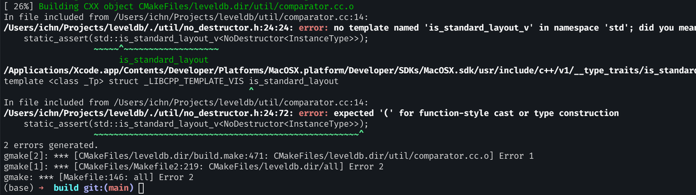

# 理解 LevelDB

LevelDB 是 Google 写的基于 LSM-Tree 的嵌入式 KV 存储引擎。内部设计非常优雅，是理解现代存储系统、深入学习 C++ 语言的绝佳入口。

我将在这里阶段性总结我学到的东西，把自己的学习过程、踩到的坑、目前的理解和下一步的计划写下来，作为一个阶段性总结。

## 如何学习？

### 阅读源码的一般方法

* [codedump notes: 如何阅读一份源代码](https://www.codedump.info/post/20200605-how-to-read-code/)
* [ichn: 如何上手一个项目](https://ichn.xyz/blog/get-started)

### 学习 LevelDB 的路径

对于 LevelDB，我计划的路径如下：

1. 编译与运行
1. 使用基础 API
    1. `DB::Open`, `Put`, `Get`, `Delete`
    2.  尝试 `WriteBatch`、`Iterator`（正向／反向）、`Snapshots`
1. 学习设计思想与 LSM-Tree 概念
    1. 从 `impl.md` 入手理解设计思想
    2. 读 Designing Data-Intensive Applications 理解 LSM-Tree 概念
1. 阅读 LevelDB 源码
    1. `include/leveldb/options.h` — 理解配置项（`create_if_missing`、`error_if_exists`、cache 大小等）
    1. 理解 LevelDB 文件结构
    1. 理解写流程
    1. 理解读流程
    1. 理解 Compaction
1. 增加数据量（如百万条记录）观察文件行为
    1. `.sst` 文件
    1. 目录结构
    1. 日志文件
    1. 使用 benchmark 工具
1. 编写测试验证
    1. 持久性（persistency）
    1. 写操作快于读操作

## 本地环境搭建与编译

在本地使用 CMake 编译 LevelDB 时，我遇到了一个已知 bug（如下图所示）：



这个 bug 已有人提过 [issue](https://github.com/google/leveldb/issues/1247)，按照 issue 建议修改 `CMakeLists.txt` 后重新 `cmake` 即可编译通过。


## 疑问：为什么 `.ldb` 文件号不连续？

为了熟悉 API，我创建了一个独立 demo 项目，与 LevelDB 源码平级：

```
/workspace/
   ├── leveldb/        ← clone 并编译好的 LevelDB 源码
   └── leveldb-demo/   ← 使用 LevelDB 的 API 写的练习
```

我测试了最基本的 API：`Open`、`Put`、`Get`、`Delete`、`Iterator`。在写入一些 key/value 后，我发现目录中出现了这些文件：

* `.ldb` 文件
* `CURRENT`
* `LOCK`
* `LOG`
* `MANIFEST`

为什么 .ldb 的文件号不连续？

好问题，我正在探究它的原因。