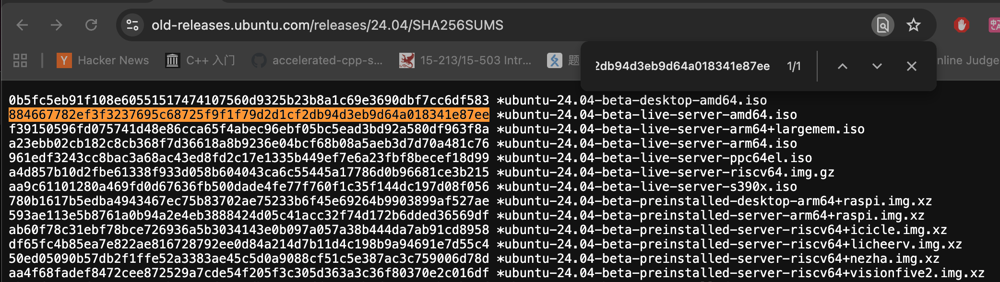

# 2025.12

## 20251231

### STL 的 erase()

`erase(pos)` 会使指向被删除元素**以及其后**的所有迭代器、指针和引用失效；指向被删除元素之前的迭代器保持有效。

但 erase 的返回值还可以用。erase() 返回值指向“被删除元素之后的那个元素”的新迭代器。

这就是为什么：

```C++
for (auto it = v.begin(); it != v.end(); ++it) {
    if (*it == 2)
        v.erase(it); // ❌
}
```

```C++
for (auto it = v.begin(); it != v.end(); ) {
    if (*it == 2)
        it = v.erase(it);   // 必须这样写
    else
        ++it;
}
```

这看起来是一个很碎片的知识，但体现了「算法不负责安全」的 STL 设计。

## 20251230

### file descriptor 与 open file description 的关系


今天做了 CSAPP 模拟的 final 题。 记录一下之前忘记的地方：


int fd 只是一个索引，真正的状态在 open file description 里

`dup2(oldfd, newfd)`: 复制 open file description  oldfd 到 newfd, 覆盖 newfd 之前的 open file description

`fork()`：复制 fd table，不复制 offset，父子进程共享 offset

为什么要学？比如我每天在用的 `./a.out > out.txt`，是怎么让 shell 不在终端输出，而是写入文件的呢？

shell 干的事就是，通过 `dup2` 把指定写入文件 fd 覆盖终端 stdout。因为 `exec()` 会替换当前进程的代码和数据，如果直接 exec, 原来的 shell 本身就没了。所以需要 `fork()` 复制 shell 的进程（子进程也继承了 fd 表。）

```c
pid = fork();

if (pid == 0) {              // 子进程
    fd = open("out.txt", O_WRONLY|O_CREAT|O_TRUNC, 0644);
    dup2(fd, STDOUT_FILENO); // 用 fd 覆盖终端 stdout → out.txt
    close(fd);
    execve("./a.out", ...);  // 你的程序开始跑
}
```


### 在 Mac 上制作 Ubuntu Server 安装 U 盘

参与了装机的一步：

1. 下载镜像 iso
   
     1. 用 gpt 写了一个并发下载、断点续传脚本

2. 比较 SHA-256 校验完整性
        

3. 烧录 U 盘
     1. 插入 U 盘，确认设备号 diskutil list
     2. Unmount diskutil unmountDisk /dev/disk4
     3. 用 dd 写 ISO 到 U 盘（核心）
     4. 中间按几次 Ctrl + T 查看进度
   
    ```bash
    sudo dd if=/Users/wenyi/Documents/Projects/OSTEP/ubuntu-24.04-beta-live-server-amd64.iso \
    of=/dev/rdisk4 \
    bs=4m 
    ```

4. 弹出 U 盘 diskutil eject /dev/disk4

现在就准备好了一个 Ubuntu Server 启动盘！