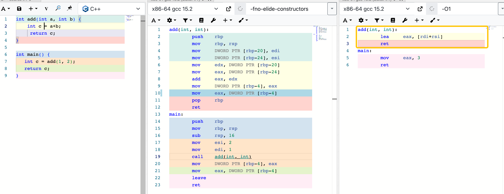

# 2026.01

## 20260107

这周开始读 OSTEP 了（我从第三部分并发开始读的），终于稍微有一点感觉知识融合了。可能是因为之前比较粗糙但也勉强读完了 CSAPP，对线程、进程、异常控制流、虚拟内存都有了一点了解。之前读得比较痛苦的原因是几乎每一个点我都一无所知，现在可以把节点连起来了，知道自己在学什么了。这似乎是我人生中，反馈周期目前最慢的事情？（很惭愧）其他的事情学起来都有即时的反馈，没有褒贬，总是想起翁恺老师的话，总之小马过河吧。

做了 Uva 818 切断圆环链这道题，与其说做了不如说是在 gpt 的帮助下看懂了别人的题解…… 我会把这道题更详细的思路更新到笔记里的。不知道做题什么时候也能有点感觉 qwq

## 20260105

`race condition`
典型的 race condition 案例：创建两个线程 A 和 B，每个线程把全局变量 counter 加 1 一千万次，主线程等待它们结束，然后打印最终的 counter 值。

这个例子里，程序层面，两个线程 A、B 共享同一个地址空间，共享全局变量 counter。机器层面，`counter++` 不是原子的，需要三个指令，分为 load, add, store 三个步骤。timer interrupt 可能发生在任意“指令边界”上，如果发生了 timer interrupt ，不管 CPU 正在执行哪条指令，只要时钟到点，硬件就向 CPU 发一个信号，切换到另一个 thread. 

之前学到有四种异常，为什么说 interrupt 是异步的，是不是就是这个例子体现的？--也不是，异步异常：是其发生时间不由当前正在执行的指令决定，而是由外部事件触发。上面这个例子中，异步不是错误的原因，数据竞争是错误的原因。即使异常是同步的，这个程序仍然会出错。

## 20260104

```bash
g++ -std=c++17 main.cpp \
  -I/opt/homebrew/include \
  -L/opt/homebrew/lib \
  -lftxui-component -lftxui-dom -lftxui-screen
```

自己上手写项目了才知道，原来如果手动 link 的话编译命令会这么麻烦，CMake 就是为解决这类问题而生的。


## 20260102

### 栈里面存的是什么？

当执行流被打断时，什么状态必须被保存？这些“执行上下文”有的用寄存器保存，有的用栈保存。编译器总是优先使用寄存器；用栈保存的原因可能是寄存器不够用了，也可能是寄存器无法保证正确性或生命周期的情况下被保存。

并不是所有临时变量都一定存在于栈上。在足够优化的情况下，如果函数不需要保存任何执行状态（例如简单的 add()），甚至可以完全不建立栈帧。



## 20260101

### 补码的目的
x86 不是有减法指令吗？为啥需要补码把负数变成非负数呢。这里需要区分的是，指令层面确实有减法，但电路层面是加法器在工作。在 ALU 里，sub a, b 是 a + (~b + 1)。有了补码，硬件只需要一个加法器，就能完成加法和减法。

