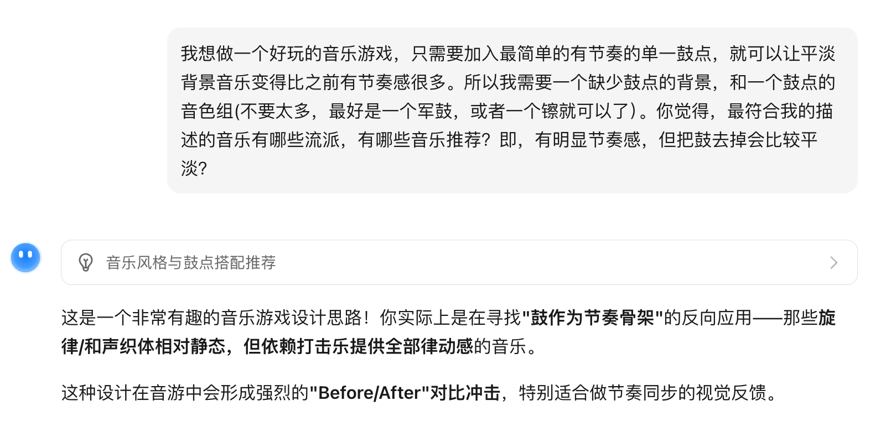
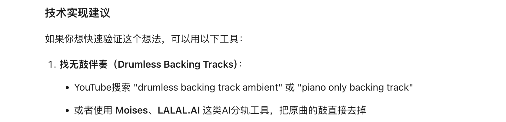

# 2026.03

## 20260302

### 语言的边界

  语言学课上，老师曾提及这个例子：因纽特人对「雪」有几十种细分词汇，但描述颜色的词汇很少。因为他们生存环境如此：雪的状态关乎能否行走、能否建屋、是否会雪盲，其他颜色不仅少见，而且对他们的生活不太重要。沃尔夫用这个例子说明，语言不只是描述思维的工具，它甚至决定思维的边界——显然，我们说不出语言里没有的东西。（虽然沃尔夫的这个例子有些夸大了）
  
  但，大模型时代，语言的制约是否仍然如此坚固？
  
  前几天我最近想做一个音乐游戏，但就是找不到合适的背景音乐。
  
  因为我想要的是一个「什么都有，唯独缺少鼓点」的背景。由用户自己来敲鼓，我觉得这样玩起来比较爽。
  
  如果把我的需求放进任何一个传统搜索引擎或视频网站搜索，我都无法获得我想要的答案。我想要「没有鼓」，但传统算法只会给我更多的关键词「鼓」，我甚至不太确定……世界上有没有现成的我想要的这种东西？
  
  直到我把这段含混的描述，磕磕绊绊写给 Kimi。

  { style="border: 1px solid #cccccc64; border-radius: 8px;" }

  Kimi 给我最大的惊喜是，它几乎是瞬间领会了我的意图，而且它知识面比我全，直接建议我去搜 Drumless 伴奏。这是一种排除了鼓的背景伴奏，设计出来让鼓手去练习。

  { style="border: 1px solid #cccccc64; border-radius: 8px;" }

  Drumless！这就是我想要的那个东西。Drum 是一个我小学就学过的单词，less 是一个我初中就学过的后缀，但 drumless 这个单词，如果不是今天我的一点兴趣，我可能一辈子不会接触到。如果不是大模型告诉我，我可能不知道 This is a thing. 更不知道要搜索这个关键词。
  
  我的感悟是，在 AI 时代，语言虽然仍然是一种边界，但这个边界已经没有高墙矗立。你确实仍然说不出「你的」语言里没有的东西，但是你完全有可能借着 AI 的力量，知道「别人的」语言里有什么。你需要的只是源源不断的兴趣和好奇。